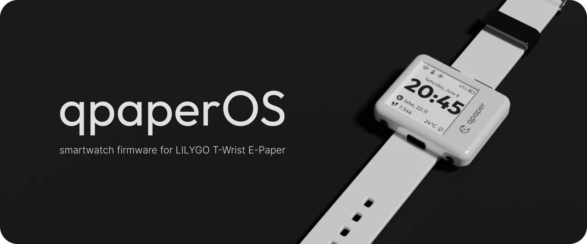
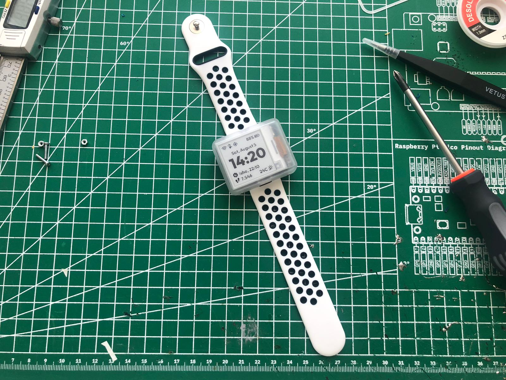

qpaperOS is a smartwatch firmware implementation for the LILYGO T-Wrist E-Paper ESP32 development board. This repositoy houses the qpaperOS source code along with 3D models and the FreeCAD file of the smartwatch case to make your very own qpaper!

## The Product

qpaper is meant to be a minimal and lighweight smartwatch that does what it needs to do: always display time. The low power E-Paper screen of the qpaper allows it to always display the time and other information without having the display blank. The ESP32 wakes up every minute to update the display to show the correct time. More information about how the firmware works can be found in the next section.

qpaper has a battery life of approx. ~5 days with a 250 mAh battery.

### Assembly

The outer sheell/case of the qpaper is meant to be 3D printed and assembled with 4 short M2 screws. The 3D models and FreeCAD file for the case can be found under `assets/3d/`

Required parts for assembly:
- LILYGO T-Wrist E-Paper ESP32 development board
- 3D printed "Shell" piece
- 3D printed "Bottom Plate" piece
- 3D printed "Buttons" piece
- 250 mAh 1S lipo battery
- Small uFl GPS antenna (not required for the non-GPS version of the development board)
- 4x short M2 screws
- 22mm watch strap (compatible with Huawei GT2/GT3 straps)
- qpaper logo sticker for the right bezel (optional ofc :D)

## The Firmware

> [!WARNING]  
> qpaperOS is not yet finished, the information here might be inaccurate

qpaperOS is the firmware part of the qpaper project. It is developed to work with the LILYGO T-Wrist E-Paper ESP32 development board. It uses the espressif-esp32-arduino framework and PlatformIO for development.

Below are features that are implemented or planned:

- [x] Display time and date
- [x] Display battery percentage (partially implemented, doesn't work correctly)
- [x] Have the ESP32 MCU on deep sleep and wakeup every minute to update the display for power saving
- [ ] GPS functionality
- [ ] GPS based step counter
- [ ] Weather display
- [ ] Islamic prayer times display