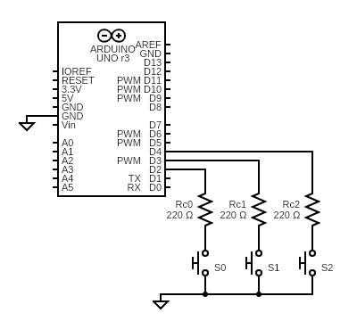

# AceButton

[](https://github.com/bxparks/AceButton/actions/workflows/aunit_tests.yml)

**New**: [GitHub Discussions](https://github.com/bxparks/AceButton/discussions)
for this project is now active! Let's use that for general support questions,
and reserve the [GitHub Issues](https://github.com/bxparks/AceButton/issues)
section for bugs and feature requests.

An adjustable, compact, event-driven button library for Arduino platforms.

This library provides classes which accept inputs from a mechanical button
connected to a digital input pin on the Arduino. The library should be able to
handle momentary buttons, maintained buttons, and switches, but it was designed
primarily for momentary buttons.

The library is named "AceButton" because:

* many configurations of the button are **adjustable**, either at compile-time
  or run-time
* the library is optimized to create **compact** objects which take up
  a minimal amount of static memory
* the library detects changes in the button state and sends **events** to
  a user-defined `EventHandler` callback function

Most of the features of the library can be accessed through 2 classes,
1 callback function, and 1 interface:

* `AceButton` (class)
* `ButtonConfig` (class)
* `EventHandler` (typedef)
* `IEventHandler` (interface)

The `AceButton` class contains the logic for debouncing and determining if a
particular event has occurred.

The `ButtonConfig` class holds various timing parameters, the event handler,
code for reading the button, and code for getting the internal clock.

The `EventHandler` is a user-defined callback function with a specific signature
which is registered with the `ButtonConfig` object. When the library detects
interesting events, the callback function is called by the library, allowing the
client code to handle the event.

The `IEventHandler` is an interface (pure abstract class) that provides an
alternative to the `EventHandler`. Instead of using a callback function, an
object of type `IEventHandler` can be used to handle the button events.

The supported events are:

* `AceButton::kEventPressed`
* `AceButton::kEventReleased`
* `AceButton::kEventClicked`
* `AceButton::kEventDoubleClicked`
* `AceButton::kEventLongPressed`
* `AceButton::kEventRepeatPressed`
* `AceButton::kEventLongReleased` (v1.8)

The basic `ButtonConfig` class assumes that each button is connected to a single
digital input pin. In some situations, the number of buttons that we want is
greater than the number of input pins available. This library provides
2 subclasses of `ButtonConfig` which may be useful:

* `EncodedButtonConfig`
    * Supports binary encoded buttons, to read `2^N - 1` buttons using `N`
      pins (e.g. 7 buttons using 3 digital pins).
* `LadderButtonConfig`
    * Supports 1-8 buttons (maybe more) on a single analog pin through a
      resistor ladder. The `analogRead()` method is used to read the different
      voltage levels corresponding to each button.

Both `EncodedButtonConfig` and `LadderButtonConfig` support all 7 events listed
above (e.g. `kEventClicked` and `kEventDoubleClicked`).

**Version**: 1.9 (2021-06-01)

**Changelog**: [CHANGELOG.md](CHANGELOG.md)

## Table of Contents

* [Features](#Features)
* [HelloButton](#HelloButton)
* [Installation](#Installation)
    * [External Dependencies](#ExternalDependencies)
    * [Source Code](#SourceCode)
* [Documentation](#Documentation)
    * [Examples](#Examples)
* [Usage](#Usage)
    * [Include Header and Use Namespace](#IncludeHeader)
    * [Pin Wiring and Initialization](#PinWiring)
    * [AceButton Class](#AceButtonClass)
        * [Sampling Rate](#SamplingRate)
        * [Compiler Error on Pin 0](#CompilerErrorOnPin0)
    * [ButtonConfig Class](#ButtonConfigClass)
        * [System ButtonConfig](#SystemButtonConfig)
        * [Configuring the EventHandler](#ConfiguringEventHandler)
        * [Timing Parameters](#TimingParameters)
        * [Hardware Dependencies](#HardwareDependencies)
        * [Multiple ButtonConfig Instances](#MultipleButtonConfigs)
    * [EventHandler Typedef](#EventHandlerTypedef)
        * [EventHandler Signature](#EventHandlerSignature)
        * [EventHandler Parameters](#EventHandlerParameters)
        * [One EventHandler Per ButtonConfig](#OneEventHandler)
        * [EventHandler Tips](#EventHandlerTips)
    * [Event Types](#EventTypes)
    * [ButtonConfig Feature Flags](#ButtonConfigFeatureFlags)
        * [Event Activation](#EventActivation)
        * [Event Suppression](#EventSuppression)
    * [Single Button Simplifications](#SingleButtonSimplifications)
    * [Multiple Buttons](#MultipleButtons)
* [Advanced Topics](#AdvancedTopics)
    * [Object-based Event Handler](#ObjectBasedEventHandler)
    * [Distinguishing Clicked and DoubleClicked](#ClickedAndDoubleClicked)
    * [Distinguishing Pressed and LongPressed](#PressedAndLongPressed)
    * [Events After Reboot](#EventsAfterReboot)
    * [Orphaned Clicks](#OrphanedClicks)
    * [Binary Encoded Buttons](#BinaryEncodedButtons)
    * [Resistor Ladder Buttons](#ResistorLadderButtons)
    * [Dynamic Allocation on the Heap](#HeapAllocation)
    * [Digital Write Fast](#DigitalWriteFast)
* [Resource Consumption](#ResourceConsumption)
    * [SizeOf Classes](#SizeOfClasses)
    * [Flash And Static Memory](#FlashAndStaticMemory)
    * [CPU Cycles](#CpuCycles)
* [System Requirements](#SystemRequirements)
    * [Hardware](#Hardware)
    * [Tool Chain](#ToolChain)
    * [Operating System](#OperatingSystem)
* [Background Motivation](#BackgroundMotivation)
  * [Non-goals](#NonGoals)
* [License](#License)
* [Feedback and Support](#FeedbackAndSupport)
* [Author](#Author)

<a name="Features"></a>
## Features

Here are the high-level features of the AceButton library:

* debounces the mechanical contact
* supports both pull-up and pull-down wiring
* event-driven through a user-defined `EventHandler` callback function
* event-driven through an object-based `IEventHandler` (>= v1.6)
* supports 7 event types:
    * `kEventPressed`
    * `kEventReleased`
    * `kEventClicked`
    * `kEventDoubleClicked`
    * `kEventLongPressed`
    * `kEventRepeatPressed`
    * `kEventLongReleased`
* adjustable configurations at runtime or compile-time
    * timing parameters
    * `digitalRead()` button read function can be overridden
    * `millis()` clock function can be overridden
* small memory footprint
    * each `AceButton` consumes 14 bytes (8-bit) or 16 bytes (32-bit)
    * each `ButtonConfig` consumes 18 bytes (8-bit) or 24 bytes (32-bit)
    * one System `ButtonConfig` instance created automatically by the library
    * 970-2180 bytes of flash memory for the simple case of 1 AceButton and 1
      ButtonConfig, depending on 8-bit or 32-bit processors
* supports multiple buttons on shared pins using various circuits
    * [Binary Encoded buttons](docs/binary_encoding/README.md)
      (e.g. 7 buttons using 3 pins)
    * [Resistor Ladder buttons](docs/resistor_ladder/README.md) (e.g. 5 buttons
      on a single analog pin)
* only 13-15 microseconds (on 16MHz ATmega328P) per polling call to
  `AceButton::check()`
* extensive testing
    * thoroughly unit tested using [AUnit](https://github.com/bxparks/AUnit)
    * tested on Arduino AVR (UNO, Nano, Micro etc), Teensy ARM (LC and 3.2),
      SAMD21 (Arduino Zero compatible), ESP8266 and ESP32

Compared to other Arduino button libraries, I think the unique or exceptional
features of the AceButton library are:

* many supported event types (e.g. LongPressed and RepeatPressed)
* able to distinguish between Clicked and DoubleClicked
* small memory usage
* thorough unit testing
* support for multiple buttons using Binary Encoding or a Resistor Ladder

<a name="HelloButton"></a>
## HelloButton

Here is a simple program (see [examples/HelloButton](examples/HelloButton))
which controls the builtin LED on the Arduino board using a momentary button
connected to PIN 2.

```C++
#include <AceButton.h>
using namespace ace_button;

const int BUTTON_PIN = 2;
const int LED_ON = HIGH;
const int LED_OFF = LOW;

AceButton button(BUTTON_PIN);

void handleEvent(AceButton*, uint8_t, uint8_t);

void setup() {
  pinMode(LED_BUILTIN, OUTPUT);
  pinMode(BUTTON_PIN, INPUT_PULLUP);
  button.setEventHandler(handleEvent);
}

void loop() {
  button.check();
}

void handleEvent(AceButton* /*button*/, uint8_t eventType,
    uint8_t /*buttonState*/) {
  switch (eventType) {
    case AceButton::kEventPressed:
      digitalWrite(LED_BUILTIN, LED_ON);
      break;
    case AceButton::kEventReleased:
      digitalWrite(LED_BUILTIN, LED_OFF);
      break;
  }
}
```

(The `button` and `buttonState` parameters are commented out to avoid an `unused
parameter` warning from the compiler. We can't remove the parameters completely
because the method signature is defined by the `EventHandler` typedef.)

<a name="Installation"></a>
## Installation

The latest stable release is available in the Arduino IDE Library Manager.
Search for "AceButton". Click install.

The development version can be installed by cloning the
GitHub repository (https://github.com/bxparks/AceButton), checking out the
`develop` branch, then manually copying over the contents to the `./libraries`
directory used by the Arduino IDE. (The result is a directory named
`./libraries/AceButton`.)

The `master` branch contains the tagged stable releases.

<a name="ExternalDependencies"></a>
### External Dependencies

The core of the library is self-contained and has no external dependencies.

The some programs in `examples/` may depend on:
* AceCommon (https://github.com/bxparks/AceCommon)

The unit tests under `tests` depend on:
* AUnit (https://github.com/bxparks/AUnit)

<a name="SourceCode"></a>
### Source Code

The source files are organized as follows:
* `src/AceButton.h` - main header file
* `src/ace_button/` - all implementation files
* `src/ace_button/testing/` - internal testing files
* `tests/` - unit tests which require [AUnit](https://github.com/bxparks/AUnit)
* `examples/` - example sketches

<a name="Documentation"></a>
## Documentation

* this [README.md](README.md)
* [docs/binary_encoding/README.md](docs/binary_encoding/README.md)
    * Explanation of reading buttons through binary encoding using the
      `Encoded4To2ButtonConfig`, `Encoded8To3ButtonConfig`,
      `EncodedButtonConfig` classes
* [docs/resistor_ladder/README.md](docs/resistor_ladder/README.md)
    * Explanation of reading buttons through a resistor ladder using the
      `LadderButtonConfig` class
* [Doxygen docs](https://bxparks.github.io/AceButton/html/) published on GitHub
  Pages which can help navigate an unfamiliar code base.

<a name="Examples"></a>
### Examples

The following example sketches are provided:

* [HelloButton](examples/HelloButton)
    * minimal program that reads a switch and control the built-in LED
* [SingleButton](examples/SingleButton)
    * single button wired with an internal pull-up resistor
* [SingleButtonPullDown](examples/SingleButtonPullDown)
    * same as `SingleButton` but with an external pull-down resistor
* [SingleButtonUsingIEventHandler](examples/SingleButtonUsingIEventHandler)
    * same as `SingleButton` using an object-based `IEventHandler`
* [Stopwatch](examples/Stopwatch)
    * measures the speed of `AceButton:check()` with a start/stop/reset button
    * uses `kFeatureLongPress`
* Multiple Buttons
    * [TwoButtonsUsingOneButtonConfig](examples/TwoButtonsUsingOneButtonConfig)
        * two buttons using one ButtonConfig
    * [TwoButtonsUsingTwoButtonConfigs](examples/TwoButtonsUsingTwoButtonConfigs/)
        * two buttons using two ButtonConfigs
    * [ThreeButtonsUsingOneButtonConfig](examples/ThreeButtonsUsingOneButtonConfig)
        * three buttons using one ButtonConfig
        * used as a reference for `ThreeButtonsUsingOneButtonConfigFast`
          (below)
    * [TunerButtons](examples/TunerButtons)
        * implements 5 radio buttons (tune-up, tune-down, and 3 presets)
        * shows multiple `ButtonConfig` and `EventHandler` instances
        * shows an example of how to use `getId()`
        * uses `kFeatureLongPress`, `kFeatureRepeatPress`,
          `kFeatureSuppressAfterLongPress`, and
          `kFeatureSuppressAfterRepeatPress`
    * [ArrayButtons](examples/ArrayButtons)
        * shows how to define an array of `AceButton` and initialize them using
          the `init()` method in a loop
* distinguishing Click versus Double-Click
    * [ClickVersusDoubleClickUsingReleased](examples/ClickVersusDoubleClickUsingReleased)
        * a way to distinguish between a `kEventClicked` from a
          `kEventDoubleClicked` using a `kEventReleased` instead
    * [ClickVersusDoubleClickUsingSuppression](examples/ClickVersusDoubleClickUsingSuppression)
        * another way to dstinguish between a `kEventClicked` from a
          `kEventDoubleClicked` using the
          `kFeatureSuppressClickBeforeDoubleClick` flag at the cost of
          increasing the response time of the `kEventClicked` event
    * [ClickVersusDoubleClickUsingBoth](examples/ClickVersusDoubleClickUsingBoth)
        * an example that combines both the "UsingPressed" and
          "UsingSuppression" techniques
* distinguishing Pressed and LongPressed
    * [examples/PressedAndLongPressed](examples/PressedAndLongPressed)
    * see also the
      [Distinguishing Pressed and LongPressed](#PressedAndLongPressed)
      subsection below
* [CapacitiveButton](examples/CapacitiveButton)
    * reads a capacitive button using the
      [CapacitiveSensor](https://github.com/PaulStoffregen/CapacitiveSensor)
      library
* Binary Encoded Buttons
    * [Encoded4To2Buttons](examples/Encoded4To2Buttons)
        * demo of `Encoded4To2ButtonConfig` class to decode `M=3` buttons with
          `N=2` pins
    * [Encoded8To3Buttons](examples/Encoded8To3Buttons)
        * demo of `Encoded8To3ButtonConfig` class to decode `M=7` buttons with
          `N=3` pins
    * [Encoded16To4Buttons](examples/Encoded16To4Buttons)
        * demo of general M-to-N `EncodedButtonConfig` class to handle `M=15`
          buttons with `N=4` pins
* Resistor Ladder Buttons
    * [LadderButtonCalibrator](examples/LadderButtonCalibrator)
        * print out the value returned by `analogRead()` for various buttons
        * useful to compare the expected values of the resistor ladder versus
          the actual values returned by the function
    * [LadderButtons](examples/LadderButtons)
        * demo of 4 buttons on a single analog pin using `analogRead()`
    * [LadderButtonsTiny](examples/LadderButtonsTiny)
        * 2 buttons on the `RESET/A0` pin of an ATtiny85 microcontroller
        * avoids wasting the RESET pin, saving the other pins for other purposes
* digitalWriteFast
    * [SingleButtonFast](examples/SingleButtonFast)
        * Same as `SingleButton` but using `ButtonConfigFast1<PIN>` which
          uses the `digitalWriteFast` library
    * [TwoButtonsUsingOneButtonConfigFast](examples/TwoButtonsUsingOneButtonConfigFast)
        * Same as `TwoButtonsUsingOneButtonConfig` but using
          `ButtonConfigFast2<PIN0,PIN1>` which uses the `digitalWriteFast`
          library
    * [ThreeButtonsUsingOneButtonConfigFast](examples/ThreeButtonsUsingOneButtonConfigFast)
        * Same as `ThreeButtonsUsingOneButtonConfig` but using
          `ButtonConfigFast3<PIN0,PIN1,PIN2>` which uses the `digitalWriteFast`
          library
* Benchmarks
    * These are internal benchmark programs. They were not written as examples
      of how to use the library.
    * [AutoBenchmark](examples/AutoBenchmark)
        * generates the timing stats (min/average/max) for the
          `AceButton::check()` method for various types of events (idle,
          press/release, click, double-click, and long-press)
    * [MemoryBenchmark](examples/MemoryBenchmark/)
        * determines the amount of flash memory consumes by various objects and
          features of the library

<a name="Usage"></a>
## Usage

There are 2 classes and one typedef that a user will normally interact with:

* `AceButton` (class)
* `ButtonConfig` (class)
* `EventHandler` (typedef)

Advanced usage is supported by:

* `EncodedButtonConfig` - binary encoded buttons supporting `2^N-1` buttons on
  `N` digital pins
* `LadderButtonConfig` - resistor ladder buttons using analog pins
* `IEventHandler` - use a callback object instead of a callback function

We explain how to use these below.

<a name="IncludeHeader"></a>
### Include Header and Use Namespace

Only a single header file `AceButton.h` is required to use this library.
To prevent name clashes with other libraries that the calling code may use, all
classes are defined in the `ace_button` namespace. To use the code without
prepending the `ace_button::` prefix, use the `using` directive:

```C++
#include <AceButton.h>
using namespace ace_button;
```

If you are dependent on just `AceButton`, the following might be sufficient:

```C++
#include <AceButton.h>
using ace_button::AceButton;
```

<a name="PinWiring"></a>
### Pin Wiring and Initialization

The `ButtonConfig` class supports the simplest wiring. Each button is connected
to a single digital input pin, as shown below. In the example below, 3 buttons
labeled `S0`, `S1` and `S2` are connected to digital input pins `D2`, `D3`, and
`D4`:



An Arduino microcontroller pin can be in an `OUTPUT` mode, an `INPUT` mode, or
an `INPUT_PULLUP` mode. This mode is controlled by the `pinMode()` method.

By default upon boot, the pin is set to the `INPUT` mode. However, this `INPUT`
mode puts the pin into a high impedance state, which means that if there is no
wire connected to the pin, the voltage on the pin is indeterminate. When the
input pin is read (using `digitalRead()`), the boolean value will be a random
value. If you are using the pin in `INPUT` mode, you *must* connect an external
pull-up resistor (connected to Vcc) or pull-down resistor (connected to ground)
so that the voltage level of the pin is defined when there is nothing connected
to the pin (i.e. when the button is not pressed).

The `INPUT_PULLUP` mode is a special `INPUT` mode which tells the
microcontroller to connect an internal pull-up resistor to the pin. It is
activated by calling `pinMode(pin, INPUT_PULLUP)` on the given `pin`. This mode
is very convenient because it eliminates the external resistor, making the
wiring simpler.

The 3 resistors `Rc1`, `Rc2` and `Rc3` are optional current limiting resistors.
They help protect the microcontroller in the case of misconfiguration. If the
pins are accidentally set to `OUTPUT` mode, then pressing one of the buttons
would connect the output pin directly to ground, causing a large amount of
current to flow that could permanently damage the microcontroller. The
resistance value of 220 ohms (or maybe 330 ohms) is high enough to keep the
current within safety limits, but low enough compared to the internal pullup
resistor that it is able to pull the digital pin to a logical 0 level. These
current limiting resistors are good safety measures, but I admit that I often
get lazy and don't use them when doing quick experiments.

The AceButton library itself does *not* call the `pinMode()` function. The
calling application is responsible for calling `pinMode()`. Normally, this
happens in the global `setup()` method but the call can happen somewhere else if
the application requires it. The reason for decoupling the hardware
configuration from the AceButton library is mostly because the library does not
actually care about the specific hardware wiring of the button. It does not care
whether an external resistor is used, or the internal resistor is used. It only
cares about whether the resistor is a pull-up or a pull-down.

See https://www.arduino.cc/en/Tutorial/DigitalPins for additional information
about the I/O pins on an Arduino.

<a name="AceButtonClass"></a>
### AceButton Class

The `AceButton` class looks like this (not all public methods are shown):
```C++
namespace ace_button {

class AceButton {
  public:
    static const uint8_t kEventPressed = 0;
    static const uint8_t kEventReleased = 1;
    static const uint8_t kEventClicked = 2;
    static const uint8_t kEventDoubleClicked = 3;
    static const uint8_t kEventLongPressed = 4;
    static const uint8_t kEventRepeatPressed = 5;
    static const uint8_t kEventLongReleased = 6;
    static const uint8_t kButtonStateUnknown = 127;

    explicit AceButton(uint8_t pin = 0, uint8_t defaultReleasedState = HIGH,
        uint8_t id = 0);
    explicit AceButton(ButtonConfig* buttonConfig, uint8_t pin = 0,
        uint8_t defaultReleasedState = HIGH, uint8_t id = 0);
    void init(uint8_t pin = 0, uint8_t defaultReleasedState = HIGH,
        uint8_t id = 0);
    void init(ButtonConfig* buttonConfig, uint8_t pin = 0,
        uint8_t defaultReleasedState = HIGH, uint8_t id = 0);

    ButtonConfig* getButtonConfig();
    void setButtonConfig(ButtonConfig* buttonConfig);
    void setEventHandler(ButtonConfig::EventHandler eventHandler);

    uint8_t getPin();
    uint8_t getDefaultReleasedState();
    uint8_t getId();

    void check();
};

}
```

Each physical button will be handled by an instance of `AceButton`. At a
minimum, the instance needs to be told the pin number of the button. This can
be done through the constructor:

```C++
const uint8_t BUTTON_PIN = 2;

AceButton button(BUTTON_PIN);

void setup() {
  pinMode(BUTTON_PIN, INPUT_PULLUP);
  ...
}
```

Or we can use the `init()` method in the `setup()`:

```C++
AceButton button;

void setup() {
  pinMode(BUTTON_PIN, INPUT_PULLUP);
  button.init(BUTTON_PIN);
  ...
}
```

Both the constructor and the `init()` function take 3 optional parameters as
shown above:

* `pin`: the I/O pin number assigned to the button
* `defaultReleasedState`: the logical value of the button when it is in its
  default "released" state (`HIGH` using a pull-up resistor,
  `LOW` for a pull-down resistor)
* `id`: an optional, user-defined identifier for the button,
  for example, an index into an array with additional information

The `pin` must be defined either through the constructor or the `init()` method.
But the other two parameters may be optional in many cases.

<a name="SamplingRate"></a>
### Sampling Rate

To read the state of the button, the `AceButton::check()` method should be
called from the `loop()` method periodically. Roughly speaking, this should be
about 4 times faster than the value of `getDebounceDelay()` so that the various
event detection logic can work properly. For example, for the default debounce
delay is 20 ms, `AceButton::check()` should be called every 5 ms. I have
successfully experimented with using a sampling delay as large as 10 ms, but I
recommend about 5 ms in most cases.

You could call the `AceButton::check()` method directly in the global `loop()`
function like this:

```C++
void loop() {
  ...
  button.check();
  ...
}
```

This would sample the button as fast as possible on your particular
microprocessor, perhaps as fast as 10,000 or 100,000 times a second, depending
on the other code that is in the `loop()` function.

Most of the time, a high sampling rate is not a problem except for 2 things:

* Calling the `AceButton::check()` has a small overhead and your processor could
  be doing other things during that time.
* If you use [Resistor Ladder Buttons](#ResistorLadderButtons) described below,
  on an ESP8266, you will trigger a bug that causes the WiFi to disconnect if
  you sample the `analogRead()` function more than a 1000 times/second.

If you want to limit the sampling rate, see the example code in [Rate
Limit CheckButtons](docs/resistor_ladder/README.md#RateLimitCheckButtons). The
code relies on using a `static` variable to implement a non-blocking delay, like
this:

```C++
AceButton button;
...

void checkButtons() {
  static unsigned long prev = millis();

  // DO NOT USE delay(5) to do this.
  unsigned long now = millis();
  if (now - prev > 5) {
    button.check();
    prev = now;
  }
}

void loop() {
  checkButtons();
  ...
}
```

<a name="CompilerErrorOnPin0"></a>
### Compiler Error On Pin 0

If you attempt to use Pin 0 in the `AceButton()` constructor:
```C++
AceButton button(0);
```
you may encounter a compile-time error such as this:
```
error: call of overloaded 'AceButton(int)' is ambiguous
```

The solution is to explicitly cast the `0` to a `uint8_t` type, or to
assign it explicitly to a `uint8_t` const, like this:
```C++
// Explicit cast
AceButton button((uint8_t) 0);

// Or assign to a const first.
static const uint8_t PIN = 0;
AceButton button(PIN);

```
See [Issue #40](https://github.com/bxparks/AceButton/issues/40) for details.

<a name="ButtonConfigClass"></a>
### ButtonConfig Class

The core concept of the AceButton library is the separation of the
button (`AceButton`) from its configuration (`ButtonConfig`).

* The `AceButton` class has the logic for debouncing and detecting the various
  events (Pressed, Released, etc), and the various bookkeeping variables
  needed to implement the logic. These variables are associated with the
  specific instance of that `AceButton`.
* The `ButtonConfig` class has the various timing parameters which control
  how much time is needed to detect certain events. This class also has the
  ability to override the default methods for reading the pin (`readButton()`)
  and the clock (`getClock()`). This ability allows unit tests to be written.

The class looks like this (not all public methods are shown):
```C++
namespace ace_button {

class ButtonConfig {
  public:
    static const uint16_t kDebounceDelay = 20;
    static const uint16_t kClickDelay = 200;
    static const uint16_t kDoubleClickDelay = 400;
    static const uint16_t kLongPressDelay = 1000;
    static const uint16_t kRepeatPressDelay = 1000;
    static const uint16_t kRepeatPressInterval = 200;

    typedef uint16_t FeatureFlagType;
    static const FeatureFlagType kFeatureClick = 0x01;
    static const FeatureFlagType kFeatureDoubleClick = 0x02;
    static const FeatureFlagType kFeatureLongPress = 0x04;
    static const FeatureFlagType kFeatureRepeatPress = 0x08;
    static const FeatureFlagType kFeatureSuppressAfterClick = 0x10;
    static const FeatureFlagType kFeatureSuppressAfterDoubleClick = 0x20;
    static const FeatureFlagType kFeatureSuppressAfterLongPress = 0x40;
    static const FeatureFlagType kFeatureSuppressAfterRepeatPress = 0x80;
    static const FeatureFlagType kFeatureSuppressClickBeforeDoubleClick = 0x100;
    static const FeatureFlagType kFeatureSuppressAll = (
        kFeatureSuppressAfterClick
        | kFeatureSuppressAfterDoubleClick
        | kFeatureSuppressAfterLongPress
        | kFeatureSuppressAfterRepeatPress
        | kFeatureSuppressClickBeforeDoubleClick);

    typedef void (*EventHandler)(AceButton* button, uint8_t eventType,
        uint8_t buttonState);

    ButtonConfig() = default;

    uint16_t getDebounceDelay();
    uint16_t getClickDelay();
    uint16_t getDoubleClickDelay();
    uint16_t getLongPressDelay();
    uint16_t getRepeatPressDelay();
    uint16_t getRepeatPressInterval();

    void setDebounceDelay(uint16_t debounceDelay);
    void setClickDelay(uint16_t clickDelay);
    void setDoubleClickDelay(uint16_t doubleClickDelay);
    void setLongPressDelay(uint16_t longPressDelay);
    void setRepeatPressDelay(uint16_t repeatPressDelay);
    void setRepeatPressInterval(uint16_t repeatPressInterval);

    virtual unsigned long getClock();
    virtual int readButton(uint8_t pin);

    bool isFeature(FeatureFlagType features);
    void setFeature(FeatureFlagType features);
    void clearFeature(FeatureFlagType features);
    void resetFeatures();

    void setEventHandler(EventHandler eventHandler);
    void setIEventHandler(IEventHandler* eventHandler);

    static ButtonConfig* getSystemButtonConfig();
};

}
```

The `ButtonConfig` (or a customized subclass) can be created and assigned to one
or more `AceButton` instances using dependency injection through the
`AceButton(ButtonConfig*)` constructor. This constructor also accepts the same
`(pin, defaultReleasedState, id)` parameters as `init(pin, defaultReleasedState,
id)` method. Sometimes it's easier to set all the parameters in one place using
the constructor. Other times, the parameters are not known until the
`AceButton::init()` method can be called from the global `setup()` method.

```C++
const uint8_t PIN1 = 2;
const uint8_t PIN2 = 4;

ButtonConfig buttonConfig;
AceButton button1(&buttonConfig, PIN1);
AceButton button2(&buttonConfig, PIN2);

void setup() {
  pinMode(PIN1, INPUT_PULLUP);
  pinMode(PIN2, INPUT_PULLUP);
  ...
}
```

Another way to inject the `ButtonConfig` dependency is to use the
`AceButton::setButtonConfig()` method but it is recommended that you use the
constructor instead because the dependency is easier to follow.

<a name="SystemButtonConfig"></a>
#### System ButtonConfig

A single instance of `ButtonConfig` called the "System ButtonConfig" is
automatically created by the library at startup. By default, all instances of
`AceButton` are automatically assigned to this singleton instance. We explain in
the _Single Button Simplifications_ section below how this simplifies the code
needed to handle a single button.

<a name="ConfiguringEventHandler"></a>
#### Configuring the EventHandler

The `ButtonConfig` class provides a number of methods which are mostly
used internally by the `AceButton` class. The one method which is expected
to be used by the calling client code is `setEventHandler()` which
assigns the user-defined `EventHandler` callback function to the `ButtonConfig`
instance. This is explained in more detail below in the
**EventHandler** section below.

<a name="TimingParameters"></a>
#### Timing Parameters

Here are the methods to retrieve the timing parameters:

* `uint16_t getDebounceDelay();` (default: 20 ms)
* `uint16_t getClickDelay();` (default: 200 ms)
* `uint16_t getDoubleClickDelay();` (default: 400 ms)
* `uint16_t getLongPressDelay();` (default: 1000 ms)
* `uint16_t getRepeatPressDelay();` (default: 1000 ms)
* `uint16_t getRepeatPressInterval();` (default: 200 ms)

The default values of each timing parameter can be changed at run-time using
the following methods:

* `void setDebounceDelay(uint16_t debounceDelay);`
* `void setClickDelay(uint16_t clickDelay);`
* `void setDoubleClickDelay(uint16_t doubleClickDelay);`
* `void setLongPressDelay(uint16_t longPressDelay);`
* `void setRepeatPressDelay(uint16_t repeatPressDelay);`
* `void setRepeatPressInterval(uint16_t repeatPressInterval);`

<a name="HardwareDependencies"></a>
#### Hardware Dependencies

The `ButtonConfig` class has 2 methods which provide hooks to its external
hardware dependencies:

* `virtual unsigned long getClock();`
* `virtual int readButton(uint8_t pin);`

By default these are mapped to the underlying Arduino system functions
respectively:

* `millis()`
* `digitalRead()`

Unit tests are possible because these methods are `virtual` and the hardware
dependencies can be swapped out with fake ones.

<a name="MultipleButtonConfigs"></a>
#### Multiple ButtonConfig Instances

We have assumed that there is a 1-to-many relationship between a `ButtonConfig`
and the `AceButton`. In other words, multiple buttons will normally be
associated with a single configuration. Each `AceButton` has a pointer to an
instance of `ButtonConfig`. So the cost of separating the `ButtonConfig` from
`AceButton` is 2 bytes in each instance of `AceButton`. Note that this is
equivalent to adding virtual methods to `AceButton` (which would add 2 bytes),
so in terms of static RAM size, this is a wash.

The library is designed to handle multiple buttons, and it assumes that the
buttons are normally grouped together into a handful of types. For example,
consider the buttons of a car radio. It has several types of buttons:

* the tuner buttons (2, up and down)
* the preset buttons (6)
* the AM/FM band button (1)

In this example, there are 9 buttons, but only 3 instances of `ButtonConfig`
would be needed.

<a name="EventHandlerTypedef"></a>
### EventHandler Typedef

The event handler is a callback function that gets called when the `AceButton`
class determines that an interesting event happened on the button. The
advantage of this mechanism is that all the complicated logic of determining
the various events happens inside the `AceButton` class, and the user will
normally not need to worry about the details.

<a name="EventHandlerSignature"></a>
#### EventHandler Signature

The event handler is defined in the `ButtonConfig` class and has the following
signature:

```C++
class ButtonConfig {
  public:
    typedef void (*EventHandler)(AceButton* button, uint8_t eventType,
        uint8_t buttonState);
    ...
};
```

The event handler is registered with the `ButtonConfig` object, not with the
`AceButton` object, although the convenience method
`AceButton::setEventHandler()` is provided as a pass-through to the underlying
`ButtonConfig` (see the _Single Button Simplifications_ section below):

```C++
ButtonConfig buttonConfig;

void handleEvent(AceButton* button, uint8_t eventType, uint8_t buttonState) {
  ...
}

void setup() {
  ...
  buttonConfig.setEventHandler(handleEvent);
  ...
}
```

The motivation for this design is to save static memory. If multiple buttons
are associated with a single `ButtonConfig`, then it is not necessary for every
button of that type to hold the same pointer to the `EventHandler` function. It
is only necessary to save that information once, in the `ButtonConfig` object.

**Pro Tip 1**: Comment out the unused parameter(s) in the `handleEvent()` method
to avoid the `unused parameter` compiler warning:
```C++
void handleEvent(AceButton* /*button*/, uint8_t eventType,
    uint8_t /*buttonState*/) {
  ...
}
```
The Arduino sketch compiler can get confused with the parameters commented out,
so you may need to add a forward declaration for the `handleEvent()` method
before the `setup()` method:
```C++
void handleEvent(AceButton*, uint8_t, uint8_t);
```

**Pro Tips 2**: The event handler can be an object instead of just a function
pointer. An object-based event handler can be useful in more complex
applications with numerous buttons. See the section on *Object-based Event
Handler* in the *Advanced Topics* below.

<a name="EventHandlerParameters"></a>
#### EventHandler Parameters

The `EventHandler` function receives 3 parameters from the `AceButton`:

* `button`
    * pointer to the `AceButton` instance that generated this event
    * can be used to retrieve the `getPin()` or the `getId()`
* `eventType`
    * the type of this event given by the various `AceButton::kEventXxx`
      constants
* `buttonState`
    * the `HIGH` or `LOW` button state that generated this event

The `button` pointer should be used only to extract information about the
button that triggered the event. It should **not** be used to modify the
button's internal variables in any way within the eventHandler. The logic in
`AceButton::check()` assumes that those internal variable are held constant,
and if they are changed by the eventHandler, unpredictable results may occur.
(I should have made the `button` be a `const AceButton*` but by the time I
realized this, there were too many users of the library already, and I did not
want to make a breaking change to the API.)

If you are using only a single button, then you should need to check
only the `eventType`.

It is not expected that `buttonState` will be needed very often. It should be
sufficient to examine just the `eventType` to determine the action that needs to
be performed. Part of the difficulty with this parameter is that it has the
value of `LOW` or `HIGH`, but the physical interpretation of those values
depends on whether the button was wired with a pull-up or pull-down resistor.
Use the helper function `button->isReleased(buttonState)` to translate the raw
`buttonState` into a more meaningful determination if you need it.

<a name="OneEventHandler"></a>
#### One EventHandler Per ButtonConfig

Only a single `EventHandler` per `ButtonConfig` is supported. An alternative
would have been to register a separate event handler for each of the 6
`kEventXxx` events. But each callback function requires 2 bytes of memory, and
it was assumed that in most cases, the calling client code would be interested
in only a few of these event types, so it seemed wasteful to allocate 12 bytes
when most of these would be unused. If the client code really wanted separate
event handlers, it can be easily emulated by invoking them through the main
event handler:

```C++
void handleEvent(AceButton* button, uint8_t eventType, uint8_t buttonState) {
  switch (eventType) {
    case AceButton::kEventPressed:
      handleEventPressed(button, eventType, buttonState);
      break;
    case AceButton::kEventReleased:
      handleEventReleased(button, eventType, buttonState);
      break;
    ...
  }
}
```

<a name="EventHandlerTips"></a>
#### EventHandler Tips

The Arduino runtime environment is single-threaded, so the `EventHandler` is
called in the middle of the `AceButton::check()` method, in the same thread as
the `check()` method. It is therefore important to write the `EventHandler`
code to run somewhat quickly, so that the delay doesn't negatively impact the
logic of the `AceButton::check()` algorithm. Since `AceButton::check()` should
run approximately every 5 ms, the user-provided `EventHandler` should run
somewhat faster than 5 ms. Given a choice, it is probably better to use the
`EventHandler` to set some flags or variables and return quickly, then do
additional processing from the `loop()` method.

Sometimes it is too convenient or unavoidable to perform a long-running
operation inside the event handler (e.g. making an HTTP). This is fine, I have
done this occasionally. Just be aware that the button scanning operation will
not work during that long-running operation.

Speaking of threads, the API of the AceButton Library was designed to work in a
multi-threaded environment, if that situation were to occur in the Arduino
world.

<a name="EventTypes"></a>
### Event Types

The supported events are defined by a list of constants in `AceButton.h`:

* `AceButton::kEventPressed` (always enabled, cannot be suppressed)
* `AceButton::kEventReleased` (default: enabled)
* `AceButton::kEventClicked` (default: disabled)
* `AceButton::kEventDoubleClicked` (default: disabled)
* `AceButton::kEventLongPressed` (default: disabled)
* `AceButton::kEventRepeatPressed` (default: disabled)
* `AceButton::kEventLongReleased` (default: disabled, autoenabled by
  `kFeatureSuppressAfterLongPress`, new for v1.8)

These values are sent to the `EventHandler` in the `eventType` parameter.

Two of the events are enabled by default, four are disabled by default but can
be enabled by using a Feature flag described below.

<a name="ButtonConfigFeatureFlags"></a>
### ButtonConfig Feature Flags

There are 9 flags defined in `ButtonConfig` which can
control the behavior of `AceButton` event handling:

* `ButtonConfig::kFeatureClick`
* `ButtonConfig::kFeatureDoubleClick`
* `ButtonConfig::kFeatureLongPress`
* `ButtonConfig::kFeatureRepeatPress`
* `ButtonConfig::kFeatureSuppressAfterClick`
* `ButtonConfig::kFeatureSuppressAfterDoubleClick`
* `ButtonConfig::kFeatureSuppressAfterLongPress`
* `ButtonConfig::kFeatureSuppressAfterRepeatPress`
* `ButtonConfig::kFeatureSuppressClickBeforeDoubleClick`
* `ButtonConfig::kFeatureSuppressAll`

These constants are used to set or clear the given flag:

```C++
// Get the current config.
ButtonConfig* config = button.getButtonConfig();

// Set a specific feature
config->setFeature(ButtonConfig::kFeatureLongPress);

// Clear a specific feature
config->clearFeature(ButtonConfig::kFeatureLongPress);

// Test for a specific feature
if (config->isFeature(ButtonConfig::kFeatureLongPress)) {
  ...
}

// Clear all features
config->resetFeatures()
```

The meaning of these flags are described below.

<a name="EventActivation"></a>
#### Event Activation

Of the 7 event types, 5 are disabled by default:

* `AceButton::kEventClicked`
* `AceButton::kEventDoubleClicked`
* `AceButton::kEventLongPressed`
* `AceButton::kEventRepeatPressed`
* `AceButton::kEventLongReleased`

To receive these events, call `ButtonConfig::setFeature()` with the following
corresponding  flags:

* `ButtonConfig::kFeatureClick`
* `ButtonConfig::kFeatureDoubleClick`
* `ButtonConfig::kFeatureLongPress`
* `ButtonConfig::kFeatureRepeatPress`
* `ButtonConfig::kFeatureSuppressAfterLongPress` (suppresses `kEventReleased`
  after a LongPress, but turns on `kEventLongReleased` as a side effect)

To disable these events, call `ButtonConfig::clearFeature()` with one of these
flags.

Enabling `kFeatureDoubleClick` automatically enables `kFeatureClick`, because we
need to have a Clicked event before a DoubleClicked event can be detected.

It seems unlikely that both `LongPress` and `RepeatPress` events would be
useful at the same time, but both event types can be activated if you need it.

<a name="EventSuppression"></a>
#### Event Suppression

Event types can be considered to be built up in layers, starting with the
lowest level primitive events: Pressed and Released. Higher level events are
built on top of the lower level events through various timing delays. When a
higher level event is detected, it is sometimes useful to suppress the lower
level event that was used to detect the higher level event.

For example, a Clicked event requires a Pressed event followed by a Released
event within a `ButtonConfig::getClickDelay()` milliseconds (200 ms by
default). The Pressed event is always generated. If a Clicked event is
detected, we could choose to generate both a Released event and a Clicked
event, and this is the default behavior.

However, many times, it is useful to suppress the Released event if the Clicked
event is detected. The `ButtonConfig` can be configured to suppress these lower
level events. Call the `setFeature(feature)` method passing the various
`kFeatureSuppressXxx` constants:

* `ButtonConfig::kFeatureSuppressAfterClick`
    * suppresses the `kEventReleased` event after a Clicked event is detected
    * also suppresses the Released event from the *first* Clicked of a
      DoubleClicked, since `kFeatureDoubleClick` automatically enables
      `kFeatureClick`
* `ButtonConfig::kFeatureSuppressAfterDoubleClick`
    * suppresses the `kEventReleased` event and the *second* Clicked event if a
      DoubleClicked event is detected
* `ButtonConfig::kFeatureSuppressAfterLongPress`
    * suppresses the `kEventReleased` event if a LongPressed event is detected
    * (v1.8) automatically enables `kEventLongReleased` event as a substitute
      for the suppressed `kEventReleased`, see [Distinguishing Pressed and Long
      Pressed](#PressedAndLongPressed) subsection below for more details.
* `ButtonConfig::kFeatureSuppressAfterRepeatPress`
    * suppresses the `kEventReleased` event after the last RepeatPressed event
* `ButtonConfig::kFeatureSuppressClickBeforeDoubleClick`
    * The *first* `kEventClicked` event is postponed by `getDoubleClickDelay()`
      millis until the code can determine if a DoubleClick has occurred. If so,
      then the postponed `kEventClicked` message to the `EventHandler` is
      suppressed.
    * See [Distinguishing Clicked and DoubleClicked](#ClickedAndDoubleClicked)
      subsection below for more info.
* `ButtonConfig::kFeatureSuppressAll`
    * a convenience parameter that is the equivalent of suppressing all of the
      previous events

By default, no suppression is performed.

As an example, to suppress the `kEventReleased` after a `kEventLongPressed`
(this is actually often the case), you would do this:

```C++
ButtonConfig* config = button.getButtonConfig();
config->setFeature(ButtonConfig::kFeatureSuppressAfterLongPress);
```

The special convenient constant `kFeatureSuppressAll` is equivalent of using all
suppression constants:

```C++
ButtonConfig* config = button.getButtonConfig();
config->setFeature(ButtonConfig::kFeatureSuppressAll);
```

All suppressions can be cleared by using:
```C++
ButtonConfig* config = button.getButtonConfig();
config->clearFeature(ButtonConfig::kFeatureSuppressAll);
```

Note, however, that the `isFeature(ButtonConfig::kFeatureSuppressAll)` currently
means "isAnyFeature() implemented?" not "areAllFeatures() implemented?" We don't
expect `isFeature()` to be used often (or at all) for `kFeatureSuppressAll`.

You can clear all feature at once using:
```C++
ButtonConfig* config = button.getButtonConfig();
config->resetFeatures();
```
This is useful if you want to reuse a `ButtonConfig` instance and you want to
reset its feature flags to its initial state.

<a name="SingleButtonSimplifications"></a>
### Single Button Simplifications

Although the AceButton library is designed to shine for multiple buttons, you
may want to use it to handle just one button. The library provides some features
to make this simple case easy.

1. The library automatically creates one instance of `ButtonConfig`
   called a "System ButtonConfig". This System ButtonConfig can be retrieved
   using the class static method `ButtonConfig::getSystemButtonConfig()`.
1. Every instance of `AceButton` is assigned an instance of the System
   ButtonConfig by default (which can be overridden manually).
1. A convenience method allows the `EventHandler` for the System
   ButtonConfig to be set easily through `AceButton` itself, instead of having
   to get the System ButtonConfig first, then set the event handler. In other
   words, `button.setEventHandler(handleEvent)` is a synonym for
   `button.getButtonConfig()->setEventHandler(handleEvent)`.

These simplifying features allow a single button to be configured and used like
this:

```C++
AceButton button(BUTTON_PIN);

void setup() {
  pinMode(BUTTON_PIN, INPUT_PULLUP);
  button.setEventHandler(handleEvent);
  ...
}

void loop() {
  button.check();
}

void handleEvent(AceButton* button, uint8_t eventType, uint8_t buttonState) {
  ...
}
```

To configure the System ButtonConfig, you may need to add something like
this to the `setup()` section:

```C++
  button.getButtonConfig()->setFeature(ButtonConfig::kFeatureLongPress);
```

<a name="MultipleButtons"></a>
### Multiple Buttons

When transitioning from a single button to multiple buttons, it's important to
remember what's happening underneath the convenience methods. The single
`AceButton` button is assigned to the System ButtonConfig that was created
automatically. When an `EventHandler` is assigned to the button, it is actually
assigned to the System ButtonConfig. All subsequent instances of `AceButton`
will also be associated with this event handler, unless another `ButtonConfig`
is explicitly assigned.

There are at least 2 ways you can configure multiple buttons.

**Option 1: Multiple ButtonConfigs**

```C++
#include <AceButton.h>
using namespace ace_button;

ButtonConfig config1;
AceButton button1(&config1);
ButtonConfig config2;
AceButton button2(&config2);

void button1Handler(AceButton* button, uint8_t eventType, uint8_t buttonState) {
  Serial.println("button1");
}

void button2Handler(AceButton* button, uint8_t eventType, uint8_t buttonState) {
  Serial.println("button2");
}

void setup() {
  Serial.begin(115200);
  pinMode(6, INPUT_PULLUP);
  pinMode(7, INPUT_PULLUP);
  config1.setEventHandler(button1Handler);
  config2.setEventHandler(button2Handler);
  button1.init(6);
  button2.init(7);
}

void loop() {
  button1.check();
  button2.check();
}
```

See the example sketch
[TwoButtonsUsingTwoButtonConfigs](examples/TwoButtonsUsingTwoButtonConfigs)
which uses 2 `ButtonConfig` instances to configure 2 `AceButton`
instances.

**Option 2: Multiple Button Discriminators**

Another technique keeps the single system `ButtonConfig` and the single
`EventHandler`, but use the `AceButton::getPin()` to discriminate between the
multiple buttons:

```C++
#include <AceButton.h>
using namespace ace_button;

AceButton button1(6);
AceButton button2(7);

void button1Handler(AceButton* button, uint8_t eventType, uint8_t buttonState) {
  Serial.println("button1");
}

void button2Handler(AceButton* button, uint8_t eventType, uint8_t buttonState) {
  Serial.println("button2");
}

void buttonHandler(AceButton* button, uint8_t eventType, uint8_t buttonState) {
  switch (button->getPin()) {
    case 6:
      button1Handler(button, eventType, buttonState);
      break;
    case 7:
      button2Handler(button, eventType, buttonState);
      break;
  }
}

void setup() {
  Serial.begin(115200);
  pinMode(6, INPUT_PULLUP);
  pinMode(7, INPUT_PULLUP);
  ButtonConfig* config = ButtonConfig::getSystemButtonConfig();
  config->setEventHandler(buttonHandler);
}

void loop() {
  button1.check();
  button2.check();
}
```

See the example code
[TwoButtonsUsingOneButtonConfig](examples/TwoButtonsUsingOneButtonConfig).
which uses a single `ButtonConfig` instance to handle 2 `AceButton`
instances.

Sometimes, it is more convenient to use the `AceButton::getId()` method
to identify the button instead of the `AceButton::getPin()`.
See [ArrayButtons](examples/ArrayButtons) for an example.

<a name="AdvancedTopics"></a>
## Advanced Topics

<a name="ObjectBasedEventHandler"></a>
### Object-based Event Handler

The `EventHandler` is a typedef that is defined to be a function pointer. This
is a simple, low-overhead design that produces the smallest memory footprint,
and allows the event handler to be written with the smallest amount of
boilerplate code. The user does not have to override a class.

In more complex applications involving larger number of `AceButton` and
`ButtonConfig` objects, it is often useful for the `EventHandler` to be an
object instead of a simple function pointer. This is especially true if the
application uses Object Oriented Programming (OOP) techniques for modularity and
encapsulation. Using an object as the event handler allows additional context
information to be injected into the event handler.

To support OOP techniques, AceButton v1.6 adds:

* `IEventHandler` interface class
    * contains a single pure virtual function `handleEvent()`
* `ButtonConfig::setIEventHandler()` method
    * accepts a pointer to an instance of the `IEventHandler` interface.

The `IEventHandler` interface is simply this:
```C++
class IEventHandler {
  public:
    virtual void handleEvent(AceButton* button, uint8_t eventType,
        uint8_t buttonState) = 0;
};
```

At least one of `ButtonConfig::setEventHandler()` or
`ButtonConfig::setIEventHandler()` must be called before events are actually
dispatched. If both are called, the last one takes precedence.

See
[examples/SingleButtonUsingIEventHandler](examples/SingleButtonUsingIEventHandler) for an example.

<a name="ClickedAndDoubleClicked"></a>
### Distinguishing Clicked and DoubleClicked

On a project using only a small number of buttons (due to physical limits or the
limited availability of pins), it may be desirable to distinguish between a
single Clicked event and a DoubleClicked event from a single button. This is a
challenging problem to solve because fundamentally, a DoubleClicked event *must
always* generate a Clicked event, because a Clicked event must happen before it
can become a DoubleClicked event.

Notice that on a desktop computer (running Windows, MacOS or Linux), a
double-click on a mouse always generates both a Clicked and a DoubleClicked. The
first Click selects the given desktop object (e.g. an icon or a window), and
the DoubleClick performs some action on the selected object (e.g. open the
icon, or resize the window).

The AceButton Library provides 3 solutions which may work for some projects:

**Method 1:** The `kFeatureSuppressClickBeforeDoubleClick` flag causes the first
Clicked event to be detected, but the posting of the event message (i.e. the
call to the `EventHandler`) is postponed until the state of the DoubleClicked
can be determined. If the DoubleClicked happens, then the first Clicked event
message is suppressed. If DoubleClicked does not occur, the long delayed
Clicked message is sent via the `EventHandler`.

There are two noticeable disadvantages of this method. First, the response time
of all Clicked events is delayed by about 600 ms (`kClickDelay +
kDoubleClickDelay`) whether or not the DoubleClicked event happens. Second, the
user may not be able to accurately produce a Clicked event (due to the physical
characteristics of the button, or the user's dexterity).

It may also be worth noting that only the Clicked event is postponed.
The accompanying Released event of the Clicked event is not postponed. So a
single click action (without a DoubleClick) produces the following sequence of
events to the EventHandler:

1. `kEventPressed` - at time 0ms
1. `kEventReleased` - at time 200ms
1. `kEventClicked` - at time 600ms (200ms + 400ms)

The `ButtonConfig` configuration looks like this:
```C++
ButtonConfig* buttonConfig = button.getButtonConfig();
buttonConfig->setFeature(ButtonConfig::kFeatureDoubleClick);
buttonConfig->setFeature(
    ButtonConfig::kFeatureSuppressClickBeforeDoubleClick);
```

See the example code at
`examples/ClickVersusDoubleClickUsingSuppression/`.

**Method 2:** A viable alternative is to use the Released event instead of the
Clicked event to distinguish it from the DoubleClicked. For this method to work,
we need to suppress the Released event after both Clicked and DoubleClicked.

The advantage of using this method is that there is no response time lag in the
handling of the Released event. To the user, there is almost no difference
between triggering on the Released event, versus triggering on the Clicked
event.

The disadvantage of this method is that the Clicked event must be be ignored
(because of the spurious Clicked event generated by the DoubleClicked). If the
user accidentally presses and releases the button too quickly, it generates a
Clicked event, which will cause the program to do nothing.

The `ButtonConfig` configuration looks like this:
```C++
ButtonConfig* buttonConfig = button.getButtonConfig();
buttonConfig->setEventHandler(handleEvent);
buttonConfig->setFeature(ButtonConfig::kFeatureDoubleClick);
buttonConfig->setFeature(ButtonConfig::kFeatureSuppressAfterClick);
buttonConfig->setFeature(ButtonConfig::kFeatureSuppressAfterDoubleClick);
```

See the example code at
`examples/ClickVersusDoubleClickUsingReleased/`.

**Method 3:** We could actually combine both Methods 1 and 2 so that either
Released or a delayed Click is considered to be a "Click". This may be the best
of both worlds.

The `ButtonConfig` configuration looks like this:
```C++
ButtonConfig* buttonConfig = button.getButtonConfig();
buttonConfig->setEventHandler(handleEvent);
buttonConfig->setFeature(ButtonConfig::kFeatureDoubleClick);
buttonConfig->setFeature(
    ButtonConfig::kFeatureSuppressClickBeforeDoubleClick);
buttonConfig->setFeature(ButtonConfig::kFeatureSuppressAfterClick);
buttonConfig->setFeature(ButtonConfig::kFeatureSuppressAfterDoubleClick);
```

See the example code at
`examples/ClickVersusDoubleClickUsingBoth/`.

<a name="PressedAndLongPressed"></a>
### Distinguishing Pressed and LongPressed

Sometimes it is useful to capture both a Pressed event and a LongPressed event
from a single button. Since every button press always triggers a `kEventPressed`
event, the only reasonable way to distinguish between Pressed and LongPressed is
to use the `kEventReleased` as a substitute for the simple Pressed event. When
we active `kFeatureLongPress`, we then must activate the
`kFeatureSuppressAfterLongPress` feature to suppress the `kEventReleased` event
after the `kEventLongPressed` to avoid yet another overlap of events.

```C++
ButtonConfig* config = button.getButtonConfig();
config->setFeature(ButtonConfig::kFeatureLongPress);
config->setFeature(ButtonConfig::kFeatureSuppressAfterLongPress);
```

This works most of the time, but I encountered an edge case. Occasionally we
want to capture the Released event after the LongPressed event, even if
`kEventReleased` must be suppressed as described above. To solve this edge case,
in v1.8, I added a new event type `kEventLongReleased` which is triggered as a
substitute for `kEventReleased`, only if `kFeatureSuppressAfterLongPress` is
used to suppress `kEventReleased`.

See the example code at
[examples/PressVersusLongPress](examples/PressVersusLongPress) to see how all
these come together.

<a name="EventsAfterReboot"></a>
### Events After Reboot

A number of edge cases occur when the microcontroller is rebooted:

* if the button is held down, should the Pressed event be triggered?
* if the button is in its natural Released state, should the Released event
  happen?
* if the button is Pressed down, and `ButtonConfig` is configured to
  support RepeatPress events, should the `kEventRepeatPressed` events
  be triggered initially?

I think most users would expect that in all these cases, the answer is no, the
microcontroller should not trigger an event until the button undergoes a
human-initiated change in state. The AceButton library implements this logic.
(It might be useful to make this configurable using a `ButtonConfig` feature
flag but that is not implemented.)

On the other hand, it is sometimes useful to perform some special action if a
button is pressed while the device is rebooted. To support this use-case, call
the `AceButton::isPressedRaw()` in the global `setup()` method (after the
button is configured). It will directly call the `digitalRead()` method
associated with the button pin and return `true` if the button is in the
Pressed state.

<a name="OrphanedClicks"></a>
### Orphaned Clicks

When a Clicked event is generated, the `AceButton` class looks for a
second Clicked event within a certain time delay (default 400 ms) to
determine if the second Clicked event is actually a DoubleClicked event.

All internal timestamps in `AceButton` are stored as `uint16_t`
(i.e. an unsigned integer of 16 bits) in millisecond units. A 16-bit
unsigned counter rolls over after 65536 iterations. Therefore, if the second
Clicked event happens between (65.636 seconds, 66.036 seconds) after the first
Clicked event, a naive-logic would erroneously consider the (long-delayed)
second click as a double-click.

The `AceButton` contains code that prevents this from happening.

Note that even if the `AceButton` class uses an `unsigned long` type (a 32-bit
integer on the Arduino), the overflow problem would still occur after `2^32`
milliseconds (i.e. 49.7 days). To be strictly correct, the `AceButton` class
would still need logic to take care of orphaned Clicked events.

<a name="BinaryEncodedButtons"></a>
### Binary Encoded Buttons

Instead of allocating one pin for each button, we can use
[Binary Encoding](http://www.learnabout-electronics.org/Digital/dig44.php) to
support large number of buttons with only a few pins. The circuit can be
implemented using a [74LS148](https://www.ti.com/product/SN74LS148) chip, or
simple diodes like this:


Three subclasses of `ButtonConfig` are provided to handle binary encoded
buttons:

* `Encoded4To2ButtonConfig`: 3 buttons with 2 pins
* `Encoded8To3ButtonConfig`: 7 buttons with 3 pins
* `EncodedButtonConfig`: `M=2^N-1` buttons with `N` pins

See [docs/binary_encoding/README.md](docs/binary_encoding/README.md) for
information on how to use these classes.

<a name="ResistorLadderButtons"></a>
### Resistor Ladder Buttons

It is possible to attach 1-8 (maybe more) buttons on a single analog pin through
a resistor ladder, and use the `analogRead()` to read the different voltages
generated by each button. An example circuit looks like this:


The `LadderButtonConfig` class handles this configuration.

See [docs/resistor_ladder/README.md](docs/resistor_ladder/README.md) for
information on how to use this class.

<a name="HeapAllocation"></a>
### Dynamic Allocation on the Heap

All classes in this library were originally designed to be created statically at
startup time and never deleted during the lifetime of the application. Since
they were never meant to be deleted through the pointer, I did not include the
virtual destructor for polymorphic classes (i.e. `ButtonConfig` and its
subclasses). The `AceButton` class is not polymorphic and does not need a
virtual destructor.

Most 8-bit processors have limited flash and static memory (for example,
32 kB flash and 2 KB static for the Nano or UNO). Adding a virtual destructor
causes **600** additional bytes of flash memory to be consumed. I suspect this
is due to the virtual destructor pulling the `malloc()` and `free()`
functions which are needed to implement the `new` and `delete` operators. For a
library that consumes only about 1200 bytes on an 8-bit processor, this increase
in flash memory size did not seem acceptable.

For 32-bit processors (e.g. ESP8266, ESP32) which have far more flash memory
(e.g. 1 MB) and static memory (e.g. 80 kB), it seems reasonable to allow
`AceButton` and `ButtonConfig` to be created and deleted from the heap.
(See [Issue #46](https://github.com/bxparks/AceButton/issues/46) for the
motivation.) Testing shows that the virtual destructor adds only about 60-120
bytes of flash memory for these microcontrollers, probably because the
`malloc()` and `free()` functions are already pulled in by something else. The
60-120 bytes of additional consumption seems trivial compared to the range of
~256 kB to ~4 MB flash memory available on these 32-bit processors.

Therefore, I added a virtual destructor for the `ButtonConfig` class (v1.5) and
enabled it for all architectures *other* than `ARDUINO_ARCH_AVR` (v1.6.1). This
prevents 8-bit processors with limited memory from suffering the overhead of an
extra 600 bytes of flash memory usage.

Even for 32-bit processors, I still recommend avoiding the creation and deletion
of objects from the heap, to avoid the risk of heap fragmentation. If a variable
number of buttons is needed, it might be possible to design the application so
that all buttons which will ever be needed are predefined in a global pool. Even
if some of the `AceButton` and `ButtonConfig` instances are unused, the overhead
is probably smaller than the overhead of wasted space due to heap fragmentation.

<a name="DigitalWriteFast"></a>
### Digital Write Fast

The `digitalWriteFast` libraries provide smaller and faster alternative versions
the `digitalWrite()`, `digitalRead()`, and `pinMode()` functions. I have used 2
such libraries, but there probably others:

* https://github.com/NicksonYap/digitalWriteFast
    * a simplified fork of the watterott library
    * but it seems to be unmaintained, e.g. does not support ATtiny85
* https://github.com/watterott/Arduino-Libs/tree/master/digitalWriteFast
    * seems to be better maintained, but is not an independent library
    * you must manually `git clone` the repo and copy or symlink the
      `digitalWriteFast/` directory into your Arduino IDE `libraries` directory

These libraries provide the following functions: `digitalWriteFast()`,
`digitalReadFast()`, and `pinModeFast()` which are usually valid only AVR
processors. These alternative functions depend on the pin number and value to be
compile-time constants, bypassing the pin number lookup tables used by the
standard versions. These fast versions can be 20-50X faster. More importantly in
many situations, they can save 100-500 bytes of flash memory by not pulling in
the pin number lookup tables.

I created 3 alternative versions of `ButtonConfig` which use the
`digitalWriteFast` libraries:

* [src/ace_button/fast/ButtonConfigFast1.h](src/ace_button/fast/ButtonConfigFast1.h)
* [src/ace_button/fast/ButtonConfigFast2.h](src/ace_button/fast/ButtonConfigFast2.h)
* [src/ace_button/fast/ButtonConfigFast3.h](src/ace_button/fast/ButtonConfigFast3.h)

(If `ButtonConfigFast4.h` is needed, it is easy to copy `ButtonConfigFast3.h`
and create a 4-pin version.)

These classes use C++ templates on the pin numbers, so that they can be passed
to the `digitalReadFast()` functions as compile-time constants. Because they
depend on an external `digitalWriteFast` library, they are **not** included in
the `<AceButton.h>` header file. They must be included explicitly, as shown
below:

```C++
#include <Arduino.h>
#include <AceButton.h>
#include <digitalWriteFast.h>
#include <ace_button/fast/ButtonConfigFast2.h>

using namespace ace_button;

// Physical pin numbers attached to the buttons.
const uint8_t BUTTON1_PHYSICAL_PIN = 2;
const uint8_t BUTTON2_PHYSICAL_PIN = 3;

// Virtual pin numbers attached to the buttons.
const uint8_t BUTTON1_PIN = 0;
const uint8_t BUTTON2_PIN = 1;

ButtonConfigFast2<BUTTON1_PHYSICAL_PIN, BUTTON2_PHYSICAL_PIN> buttonConfig;
AceButton button1(&buttonConfig, BUTTON1_PIN);
AceButton button2(&buttonConfig, BUTTON2_PIN);

void handleEvent(AceButton* button, uint8_t eventType, uint8_t buttonState) {
  ...
}

void setup() {
  ...
}

void loop() {
  // Should be called every 4-5ms or faster, for the default debouncing time
  // of ~20ms.
  button1.check();
  button2.check();
}
```

Each physical pin number given as template arguments to the
`ButtonConfigFast2<>` class corresponds to a virtual pin number (starting with
0) assigned to the `AceButton` object.  Within the event handler, everything is
referenced by the virtual pin number, just like the `EncodedButtonConfig` and
`LadderButtonConfig` classes.

Here are the example programs for each `ButtonConfigFast{N}` class:

* [examples/SingleButtonFast](examples/SingleButtonFast) (`ButtonConfigFast1`)
* [examples/TwoButtonsUsingOneButtonConfigFast](examples/TwoButtonsUsingOneButtonConfigFast) (`ButtonConfigFast2`)
* [examples/ThreeButtonsUsingOneButtonConfigFast](examples/ThreeButtonsUsingOneButtonConfigFast) (`ButtonConfigFast3`)

The `LadderButtonConfig` class uses `analogRead()` which does not seem to
directly benefit from `digitalWriteFast` libraries. However, if you use
`pinModeFast()` instead of `pinMode()` in your global `setup()` function, you
can save about 50 bytes of flash (I think).

The `Encoded4To2ButtonConfig` and `Encoded8To3ButtonConfig` classes would
probably benefit from `digitalWriteFast` libraries, but I have not created the
"fast" versions of these (i.e. `Encoded4To2ButtonConfigFast` and
`Encoded8To3ButtonConfigFast`) because I have not needed them personally.

The general `EncodedButtonConfig` class is more difficult to convert into a
"fast" version, because its constructor takes a pointer argument to an array of
physical pins. These are not compile-time constants so we would not be able to
use the `digitalWriteFast` libraries directly. I think the best we could do is
create special `Encoded16To4ButtonConfigFast` and `Encoded32To5ButtonConfigFast`
classes.

<a name="ResourceConsumption"></a>
## Resource Consumption

<a name="SizeOfClasses"></a>
### SizeOf Classes

Here are the sizes of the various classes on the 8-bit AVR microcontrollers
(Arduino Uno, Nano, etc):

```
sizeof(AceButton): 14
sizeof(ButtonConfig): 18
sizeof(ButtonConfigFast1<>): 18
sizeof(ButtonConfigFast2<>): 18
sizeof(ButtonConfigFast3<>): 18
sizeof(Encoded4To2ButtonConfig): 21
sizeof(Encoded8To3ButtonConfig): 22
sizeof(EncodedButtonConfig): 25
sizeof(LadderButtonConfig): 26
```

For 32-bit microcontrollers:

```
sizeof(AceButton): 16
sizeof(ButtonConfig): 24
sizeof(Encoded4To2ButtonConfig): 28
sizeof(Encoded8To3ButtonConfig): 28
sizeof(EncodedButtonConfig): 36
sizeof(LadderButtonConfig): 36
```

(An early version of `AceButton`, with only half of the functionality, consumed
40 bytes. It got down to 11 bytes before additional functionality increased it
to 14.)

<a name="FlashAndStaticMemory"></a>
### Flash And Static Memory

[MemoryBenchmark](examples/MemoryBenchmark/) was used to determine the
size of the library for various microcontrollers (Arduino Nano to ESP32). Here
are 2 samples:

Arduino Nano

```
+--------------------------------------------------------------+
| functionality                   |  flash/  ram |       delta |
|---------------------------------+--------------+-------------|
| Baseline                        |    610/   11 |     0/    0 |
|---------------------------------+--------------+-------------|
| ButtonConfig                    |   1946/   51 |  1336/   40 |
| ButtonConfigFast1               |   1662/   51 |  1052/   40 |
| ButtonConfigFast2               |   1630/   65 |  1020/   54 |
| ButtonConfigFast3               |   1678/   79 |  1068/   68 |
| Encoded4To2ButtonConfig         |   2160/   82 |  1550/   71 |
| Encoded8To3ButtonConfig         |   2428/  139 |  1818/  128 |
| EncodedButtonConfig             |   2474/  162 |  1864/  151 |
| LadderButtonConfig              |   2476/  175 |  1866/  164 |
+--------------------------------------------------------------+
```

ESP8266:

```
+--------------------------------------------------------------+
| functionality                   |  flash/  ram |       delta |
|---------------------------------+--------------+-------------|
| Baseline                        | 256924/26800 |     0/    0 |
|---------------------------------+--------------+-------------|
| ButtonConfig                    | 258424/26840 |  1500/   40 |
| ButtonConfigFast1               |     -1/   -1 |    -1/   -1 |
| ButtonConfigFast2               |     -1/   -1 |    -1/   -1 |
| ButtonConfigFast3               |     -1/   -1 |    -1/   -1 |
| Encoded4To2ButtonConfig         | 258732/26916 |  1808/  116 |
| Encoded8To3ButtonConfig         | 258876/26980 |  1952/  180 |
| EncodedButtonConfig             | 259004/27020 |  2080/  220 |
| LadderButtonConfig              | 259048/27024 |  2124/  224 |
+--------------------------------------------------------------+
```

<a name="CpuCycles"></a>
### CPU Cycles

The profiling numbers for `AceButton::check()`,
`EncodedButtonConfig::checkButtons()`, and `LadderButtonConfig::checkButtons()`
can be found in [examples/AutoBenchmark](examples/AutoBenchmark). Here are 2
samples, in units of microseconds.

Arduino Nano:

```
+---------------------------+-------------+---------+
| Button Event              | min/avg/max | samples |
|---------------------------+-------------+---------|
| idle                      |   8/ 15/ 24 |    1931 |
| press/release             |   8/ 16/ 24 |    1924 |
| click                     |  12/ 15/ 24 |    1924 |
| double_click              |  12/ 15/ 32 |    1921 |
| long_press/repeat_press   |  12/ 16/ 28 |    1924 |
|---------------------------+-------------+---------|
| ButtonConfigFast1         |   8/ 14/ 24 |    1933 |
| ButtonConfigFast2         |  20/ 27/ 36 |    1910 |
| ButtonConfigFast3         |  28/ 40/ 48 |    1886 |
|---------------------------+-------------+---------|
| Encoded4To2ButtonConfig   |  60/ 67/ 92 |    1839 |
| Encoded8To3ButtonConfig   | 164/186/208 |    1659 |
| EncodedButtonConfig       |  80/100/124 |    1785 |
| LadderButtonConfig        | 176/199/272 |    1640 |
+---------------------------+-------------+---------+
```

ESP8266:

```
+---------------------------+-------------+---------+
| Button Event              | min/avg/max | samples |
|---------------------------+-------------+---------|
| idle                      |   6/  8/ 52 |    1917 |
| press/release             |   6/  8/ 62 |    1907 |
| click                     |   6/  8/ 38 |    1902 |
| double_click              |   6/  8/ 32 |    1907 |
| long_press/repeat_press   |   6/  8/ 41 |    1903 |
|---------------------------+-------------+---------|
| Encoded4To2ButtonConfig   |  22/ 27/ 55 |    1878 |
| Encoded8To3ButtonConfig   |  54/ 66/ 90 |    1806 |
| EncodedButtonConfig       |  42/ 54/ 81 |    1831 |
| LadderButtonConfig        | 136/149/491 |    1682 |
+---------------------------+-------------+---------+
```

<a name="SystemRequirements"></a>
## System Requirements

<a name="Hardware"></a>
### Hardware

This library has Tier 1 support on the following boards:

* Arduino Nano (16 MHz ATmega328P)
* SparkFun Pro Micro (16 MHz ATmega32U4)
* SAMD21 M0 Mini (48 MHz ARM Cortex-M0+)
* STM32 Blue Pill (STM32F103C8, 72 MHz ARM Cortex-M3)
* NodeMCU 1.0 (ESP-12E module, 80MHz ESP8266)
* WeMos D1 Mini (ESP-12E module, 80 MHz ESP8266)
* ESP32 Dev Module (ESP-WROOM-32 module, 240MHz dual core Tensilica LX6)
* Teensy 3.2 (96 MHz ARM Cortex-M4)

Tier 2 support can be expected on the following boards, mostly because I don't
test these as often:

* ATtiny85 (8 MHz ATtiny85)
* Arduino Pro Mini (16 MHz ATmega328P)
* Teensy LC (48 MHz ARM Cortex-M0+)
* Mini Mega 2560 (Arduino Mega 2560 compatible, 16 MHz ATmega2560)

The following boards are **not** officially supported, but AceButton may
accidentally work on these:

* Any platform using the ArduinoCore-API
  (https://github.com/arduino/ArduinoCore-api).
    * For example, Nano Every, MKRZero, and Raspberry Pi Pico RP2040.

<a name="ToolChain"></a>
### Tool Chain

This library was developed and tested using:

* [Arduino IDE 1.8.13](https://www.arduino.cc/en/Main/Software)
* [Arduino CLI 0.14.0](https://arduino.github.io/arduino-cli)
* [SpenceKonde ATTinyCore 1.5.2](https://github.com/SpenceKonde/ATTinyCore)
* [Arduino AVR Boards 1.8.3](https://github.com/arduino/ArduinoCore-avr)
* [Arduino SAMD Boards 1.8.9](https://github.com/arduino/ArduinoCore-samd)
* [SparkFun AVR Boards 1.1.13](https://github.com/sparkfun/Arduino_Boards)
* [SparkFun SAMD Boards 1.8.1](https://github.com/sparkfun/Arduino_Boards)
* [STM32duino 1.9.0](https://github.com/stm32duino/Arduino_Core_STM32)
* [ESP8266 Arduino Core 2.7.4](https://github.com/esp8266/Arduino)
* [ESP32 Arduino Core 1.0.6](https://github.com/espressif/arduino-esp32)
* [Teensyduino 1.53](https://www.pjrc.com/teensy/td_download.html)

It should work with [PlatformIO](https://platformio.org/) but I have
not tested it.

The library works on Linux or MacOS (using both g++ and clang++ compilers) using
the [EpoxyDuino](https://github.com/bxparks/EpoxyDuino) emulation layer.

<a name="OperatingSystem"></a>
### Operating System

I use Ubuntu Linux 18.04 and 20.04 for most of my development.

<a name="BackgroundMotivation"></a>
## Background Motivation

There are numerous "button" libraries out there for the Arduino. Why write
another one? I wanted to add a button to an addressable strip LED controller,
which was being refreshed at 120 Hz. I had a number of requirements:

* the button needed to support a LongPress event, in addition to the simple
  Press and Release events
* the button code must not interfere with the LED refresh code which was
  updating the LEDs at 120 Hz
* well-tested, I didn't want to be hunting down random and  obscure bugs

Since the LED refresh code needed to run while the button code was waiting for
a "LongPress" delay, it seemed that the cleanest API for a button library
would use an event handler callback mechanism. This reduced the number of
candidate libraries to a handful. Of these, only a few of them supported a
LongPress event. I did not find the remaining ones flexible enough for my
button needs in the future. Finally, I knew that it was tricky to write correct
code for debouncing and detecting various events (e.g. DoubleClick, LongPress,
RepeatPress). I looked for a library that contained unit tests, and I found
none.

I decided to write my own and use the opportunity to learn how to create and
publish an Arduino library.

<a name="NonGoals"></a>
### Non-goals

An Arduino UNO or Nano has 16 times more flash memory (32KB) than static memory
(2KB), so the library is optimized to minimize the static memory usage. The
AceButton library is not optimized to create a small program size (i.e. flash
memory), or for small CPU cycles (i.e. high execution speed). I assumed that if
you are seriously optimizing for program size or CPU cycles, you will probably
want to write everything yourself from scratch.

That said, [examples/MemoryBenchmark](examples/MemoryBenchmark/) shows that the
library consumes between 970-2180  bytes of flash memory, and
[AutoBenchmark](examples/AutoBenchmark) shows that `AceButton::check()` takes
between ~15 microseconds on a 16MHz ATmega328P chip and 2-3 microseconds on an
ESP32. Hopefully that is small enough and fast enough for the vast majority of
people.

With v1.9, I started using AceButton on an ATtiny85 which has only 8kB of flash
and 0.5 kB of static RAM. Flash memory consumption became more important and I
created the `ButtonConfigFast1`, `ButtonConfigFast2`, and `ButtonConfigFast3`
classes to decrease the flash memory consumption by using one of the
`<digitalWriteFast.h>` 3rd party libraries. See
[Digital Write Fast](#DigitalWriteFast) for more info.

<a name="License"></a>
## License

* Versions 1.0 to 1.0.6:
  [Apache License 2.0](https://www.apache.org/licenses/LICENSE-2.0)
* Versions 1.1 and above: [MIT License](https://opensource.org/licenses/MIT)

I changed to the MIT License starting with version 1.1 because the MIT License
is so simple to understand. I could not be sure that I understood what the
Apache License 2.0 meant.

<a name="FeedbackAndSupport"></a>
## Feedback and Support

If you have any questions, comments and other support questions about how to
use this library, please use the
[GitHub Discussions](https://github.com/bxparks/AceButton/discussions)
for this project. If you have bug reports or feature requests, please file a
ticket in [GitHub Issues](https://github.com/bxparks/AceButton/issues).
I'd love to hear about how this software and its documentation can be improved.
I can't promise that I will incorporate everything, but I will give your ideas
serious consideration.

Please refrain from emailing me directly unless the content is sensitive. The
problem with email is that I cannot reference the email conversation when other
people ask similar questions later.

<a name="Author"></a>
## Author

Created by Brian T. Park (brian@xparks.net).
