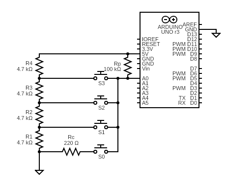
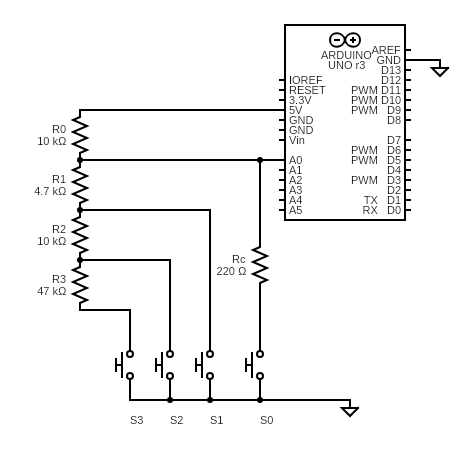
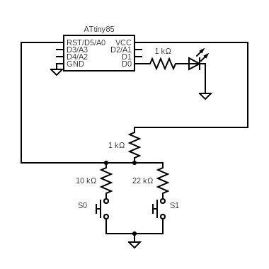

# Resistor Ladder

A resistor ladder is a method for detecting multiple buttons on a single
analog pin. Each pin is configured to register a different voltage.
The voltage can be read using an analog-to-digital converter (ADC) on the pin.
On the Arduino, the `analogRead()` method returns an integer corresponding to
the voltage on the pin. Most Arduino boards have a 10-bit ADC, so the values
from the function ranges from `0` to `1023`. See the following references for
more details:

* https://electronics.stackexchange.com/questions/99417/
* https://forum.arduino.cc/index.php?topic=440200.0
* http://www.ignorantofthings.com/2018/07/the-perfect-multi-button-input-resistor.html

The `LadderButtonConfig` class was created to support multiple buttons on a
single analog line.

## Table of Contents

* [Circuits](#Circuits)
    * [Circuit 1: Active Voltage Divider](#Circuit1)
    * [Circuit 2: Series Resistor Ladder](#Circuit2)
    * [Circuit 3: Parallel Resistor Ladder (Recommended)](#Circuit3)
* [LadderButtonConfig](#LadderButtonConfig)
    * [Public Methods](#PublicMethods)
    * [Constructor](#Constructor)
    * [Rate Limit CheckButtons](#RateLimitCheckButtons)
* [Examples](#Examples)
    * [LadderButtons](#LadderButtons)
    * [LadderButtonsTiny](#LadderButtonsTiny)
* [Level Matching Tolerance Range](#LevelMatchingTolerance)
* [Ladder Button Calibrator](#LadderButtonCalibrator)
* [Appendix](#Appendix)

<a name="Circuits"></a>
## Circuits

There are at least 3 different ways to wire up the resistor ladder. The
`LadderButtonConfig` does not care which wiring is used, so long as the correct
expected voltage levels are given to the class. As explained below, my
recommended circuit is Circuit 3.

<a name="Circuit1"></a>
### Circuit 1: Active Voltage Divider

The following circuit is the easiest to understand, but it seems to have
a disadvantage that I describe below. I'm not sure if this circuit has a
well-known name, so I will call it the "active voltage divider".



Here we have 4 identical resistors, `R1` to `R4`, each 4.7 kOhm. The 4 identical
resistors divide the voltage equally (0, 0.25, 0.5, 0.75) so that each button
connects the `A0` pin to the various voltages: 0V, 1.25V, 2.5V, and 3.75V. When
no buttons are pressed, the `A0` pin reads 5V through the 100 kOhm pull-up
registor `Rp`. This resistor value is high enough that it does not significantly
change the effective resistance when the various buttons are pressed.

The 220 Ohm registor labeled `Rc` is a current limiting registor for safety. It
is not strictly necessary, it could be replaced with a straight wire and the
circuit would still work. However, it prevents accidental damage to the
microcontroller if the `A0` pin was accidentally switched to `OUTPUT` mode and
set to `HIGH`. If the `S0` button is pressed in this state, the pin would be
shorted to ground, and the amount of current flowing through the `A0` would
destroy the microcontroller. The maximum current for an ATmega328 (e.g. Arduino
UNO R3) is 40mA. The maximum current for an ATmega32u4 (e.g. Sparkfun Micro) is
20mA. The current limiting resistor should be adjusted to be below these limits.

It should be evident that the `R1` to `R4` resistors do not need to be 4.7
kOhm. They could be 10 kOhm each, or maybe 22 kOhm. However, notice that there
will always some small amount of current flowing through the circuit, even if no
buttons are pressed. If your device is powered through the USB, this current is
probably negligle. But if the microcontroller is battery powered, this power
drainage could shorten the battery life of your device significantly.

<a name="Circuit2"></a>
### Circuit 2: Series Resistor Ladder

There are many examples on the web showing a circuit like this:



When no buttons are pressed, the `R0` resistor pulls the voltage up to 5V.
Since the `A0` is a high-impedance input, there is no current flowing in the
system when there are no buttons pressed. Pressing button `S0` brings the
voltage down to almost 0V, through the same current limiting resistor `Rc` that
we described in Circuit 1. Each succesive button `S1` to `S3` adds progressively
more resistance to the voltage divider.

Each resistor is a different value, so it is slightly more difficult to
calculate the expected voltage at the input pin:

```
V0/Vcc = 0V
V1/Vcc = R1 / (R0 + R1) = 0.32
V2/Vcc = (R1 + R2) / (R0 + R1 + R2) = 0.60
V3/Vcc = (R1 + R2 + R3) / (R0 + R1 + R2 + R3) = 0.86
```

The difficulty with this circuit is calculating the required resistor values for
the number of buttons that you want for a given pin. Let `N` be the number of
buttons and resistors (as a concrete example, let `N=8`). Let `R0` be the
top-most resistor, for example, 10 kOhm. Ideally, we want the voltages to be
spaced in equal voltage increments of `1/N`. With a little bit of algebra, we
can derive a formula for the resistor values.

For the `R(1)` resistor, the formula is:
```
R(1)      1
---- = -------
R(0)    (N-1)
```

For the `R(2)` to `R(N-1)` resistors, the formula is:
```
R(i)      i           (i - 1)
---- = -------  -  ------------- , for i = 2 to N-1
R(0)   (N - i)     (N - (i - 1))
```

which can be simplified down to:

```
R(i+1)    (N-i+1)
------ =  ------- , for i = 1 to N-2
 R(i)     (N-i-1)
```

To make this concrete, let's suppose we want 8 buttons, for `N = 8`. The 8
resistors can be calculated using the following pattern:
```
R1/R0 = 1/(N-1) = 1/7
R2/R1 = (N-1+1)/(N-1-1) = 8/6
R3/R2 = (N-2+1)/(N-2-1) = 7/5
R4/R3 = (N-3+1)/(N-3-1) = 6/4
R5/R4 = (N-4+1)/(N-4-1) = 5/3
R6/R5 = (N-5+1)/(N-5-1) = 4/2
R7/R6 = (N-6+1)/(N-6-1) = 3/1
```

This means that we need resistors of values:
```
10k, 1.4k, 1.9k, 2.2k, 3.3k, 5.5k, 11.1k, 33k
```

This leads to the second problem with this circuit. Resistors normally come in
certain series of values, and it is can be difficult to get values which don't
fall within the series. The common values for resistors follow the [E series of
preferred numbers](https://en.wikipedia.org/wiki/E_series_of_preferred_numbers).

* The E3 series include: 1, 2.2, 4.7
* The E6 series include: 1.0, 1.5, 2.2, 3.3, 4.7, 6.8
* The E12 series include: 1.0, 1.2, 1.5, 1.8, 2.2, 2.7, 3.3, 3.9, 4.7, 5.6,
  6.8, 8.2

If we subsitute a specific resistor with another value, this circuit has the
problem that the substituted resistor affects the voltage levels of all other
resistors down the line. Recaculating and validating those resistor values can
be a bit of a chore.

These issues with Circuit 2 lead me to recommend Circuit 3 instead.

<a name="Circuit3"></a>
### Circuit 3: Parallel Resistor Ladder (Recommended)

The following circuit attaches a separate resistor for each button, like this:


Each button creates a simple voltage divider, where the value at pin `A0`
is simply the ratio of 2 resistors:

```
V(i)/Vcc = Rp / (R(i) + Rp), for i = 0 to N-1
```

The `R0` resistor serves the same function as the current limiting `Rc`
resistors in the previous circuits. The `R0` could be 0 ohms, i.e. a straight
wire, but it is safer to be 220 ohms (or 330 ohms) to limit the current in
case of a mis-wiring.

The expected voltage levels for commonly available resistors in the E6 series
can be calculated with a simple spreadsheet:

```
r(i)  v(i)
----  ----
0.00  0.00
0.10  0.09
0.15  0.13
0.22  0.18
0.33  0.25
0.47  0.32
0.68  0.40
1.00  0.50
1.50  0.60
2.20  0.69
3.30  0.77
4.70  0.82
6.80  0.87
10.0  0.91
infinity 1.00
```

where
```
r(i) = R(i) / Rp
v(i) = V(i) / Vcc
```

Let's say we want 4 buttons, which means we want the voltage levels to be spaces
at 0.25 intervals: 0.0, 0.25, 0.5, 0.75. Using `Rp = 10 kOhm`, we can see from
the table that the closest values for r(i) are: 0k, 3.3k, 10k, 33k. But in many
resistor boxes (including my own), the 3.3 kOhm resistors are harder to find
than 4.7 kOhm resistors. So if we replaced them with 4.7 kOhm and 47kOhm
resistors, we get voltage levels of: 0.0, 0.32, 0.50, 0.82. These are close
enough to the desired voltage levels that we are probably ok.

There several things about this circuit that I like:

* The circuit is easy to undersatnd, and the voltage levels are easy to
  calculate.
* Subsitution of one resistor of one button with another value does *not* affect
  the voltage levels of the other buttons.
* If no buttons are pressed, there is no current flowing through the circuit,
  so this circuit is friendly to battery powered applications.
* The number of resistors required is `N+1`, where `N` is the number of buttons.
  This is the same number as Circuit 2, and smaller than Circuit 1.

For these reasons, Circuit 3 is the one that I would recommend.

<a name="LadderButtonConfig"></a>
## LadderButtonConfig

<a name="PublicMethods"></a>
### Public Methods

The public API for `LadderButtonConfig` looks something like this:

```C++
class LadderButtonConfig : public ButtonConfig {
  public:
    LadderButtonConfig(
        uint8_t pin,
        uint8_t numLevels,
        const uint16_t levels[],
        uint8_t numButtons,
        AceButton* const buttons[],
        uint8_t defaultReleasedState = HIGH);

    int readButton(uint8_t pin) override;

    void checkButtons() const;

    uint8_t getNoButtonPin() const;
};
```

<a name="Constructor"></a>
### Constructor

The constructor takes a number of parameters:

* a list of voltage levels `levels[]` expected for each button, given as
  as integer values returned by the `analogRead()` function,
* the list of `AceButton` instances `buttons[]` which should respond to those
  buttons
* the ADC `pin` number where the resistors and buttons are attached

Each `AceButton` should be given a "virtual" pin number (in other words, a
synthetic pin number) which corresponds to each button on the analog pin.
These virtual pin numbers will range from `0` to `N-1`.

The `levels[]` array **must** contain monotonically increasing values of
voltage levels. The number of elements in this array is equal to `N+1`, where
`N` is the maximum number of buttons.

The last value of the `levels[]` array should be the largest number that is
expected to be returned by the `analogRead()` method. For a 10-bit ADC, this
value is either `2^10 - 1 = 1023` or exactly `2^10 = 1024`. For a 12-bit ADC,
the value is `2^12 - 1 = 4095` or exactly `2^12 = 4096`.

<a name="RateLimitCheckButtons"></a>
### Rate Limit CheckButtons

The `LadderButtonConfig::checkButtons()` calls `analogRead()` which is an
expensive function compared to `digitalRead()`. On an AVR processor,
`analogRead()` can take 100 micros compared to single-digit micros for
`digitalRead().

On the ESP8266, there is an even bigger problem. If the `analogRead()` function
is called too quickly, it causes the WiFi to disconnect, as detailed by these
bug reports:

* https://github.com/esp8266/Arduino/issues/1634
* https://github.com/esp8266/Arduino/issues/5083

According to a comment in the
[EspScopeA0/Bravo](https://github.com/krzychb/EspScopeA0/tree/master/Bravo)
project, which references an Espressif ESP8266 FAQ PDF documentation (that seems
to have moved to a new URL that I cannot locate), the `analogRead()` can be read
as fast as 1000 samples/second, or every 1 ms, without interfering with the
WiFi. It also shows experimental results that suggest that in reality, an even
slower sampling rate of less than 200 samples/second is needed to get long-term
WiFi stability. Fortunately, AceButton needs to sample the A0 every 4-5 ms, or
only about 200 samples/second so we should be fine.

For these reasons, I recommend always rate-limit the call to
`LadderButtonConfig::checkButtons()` no matter what processor you are using.
There is no advantage to calling `checkButtons()` more often than necessary, and
your microprocessor could be doing other things during that time.

There are several ways to do do rate-limiting. I show one way in the
`LadderButtons.ino` example shown below, using an extra variable that keeps
track of the `millis()` timestamp of the previous call.

```C++
void checkButtons() {
  static unsigned long prev = millis();

  // DO NOT USE delay(5) to do this.
  unsigned long now = millis();
  if (now - prev >= 5) {
    buttonConfig.checkButtons();
    prev = now;
  }
}
```

Another way is to use a multitasking or coroutine library, to call
`checkButtons()` with a non-blocking delay function. I often use my coroutine
library [AceRoutine](https://github.com/bxparks/AceRoutine), but this is an
advanced usage which seems out of scope for this documentation.

<a name="Examples"></a>
## Examples

<a name="LadderButtons"></a>
### LadderButtons

The example code [LadderButtons](../../examples/LadderButtons/) looks something
like this:

```C++
#include <AceButton.h>
using namespace ace_button;

static const uint8_t BUTTON_PIN = A0;

// Create 4 AceButton objects, with their virtual pin number 0 to 3. The number
// of buttons does not need to be identical to the number of analog levels. You
// can choose to define only a subset of buttons here.
//
// Use the 4-parameter `AceButton()` constructor with the `buttonConfig`
// parameter explicitly to `nullptr` to prevent the automatic creation of the
// default SystemButtonConfig, saving about 30 bytes of flash and 26 bytes of
// RAM on an AVR processor.
static const uint8_t NUM_BUTTONS = 4;
static AceButton b0(nullptr, 0);
static AceButton b1(nullptr, 1);
static AceButton b2(nullptr, 2);
static AceButton b3(nullptr, 3);
static AceButton* const BUTTONS[NUM_BUTTONS] = {
    &b0, &b1, &b2, &b3,
};

// Define the ADC voltage levels for each button.
// For 4 buttons, we need 5 levels.
static const uint8_t NUM_LEVELS = NUM_BUTTONS + 1;
static const uint16_t LEVELS[NUM_LEVELS] = {
  0 /* 0%, short to ground */,
  327 /* 32%, 4.7 kohm */,
  512 /* 50%, 10 kohm */,
  844 /* 82%, 47 kohm */,
  1023 /* 100%, 10-bit ADC, open circuit */,
};

// The LadderButtonConfig constructor binds the AceButton to the
// LadderButtonConfig.
static LadderButtonConfig buttonConfig(
  BUTTON_PIN, NUM_LEVELS, LEVELS, NUM_BUTTONS, BUTTONS
);

// The event handler for the button.
void handleEvent(AceButton* button, uint8_t eventType, uint8_t buttonState) {

  // Print out a message for all events.
  Serial.print(F("handleEvent(): "));
  Serial.print(F("virtualPin: "));
  Serial.print(button->getPin());
  Serial.print(F("; eventType: "));
  Serial.print(eventType);
  Serial.print(F("; buttonState: "));
  Serial.println(buttonState);
}

void setup() {
  delay(1000); // some microcontrollers reboot twice
  Serial.begin(115200);
  while (! Serial); // Wait until Serial is ready - Leonardo/Micro

  // Don't use internal pull-up resistor.
  pinMode(BUTTON_PIN, INPUT);

  // Configure the ButtonConfig with the event handler, and enable all higher
  // level events.
  buttonConfig.setEventHandler(handleEvent);
  buttonConfig.setFeature(ButtonConfig::kFeatureClick);
  buttonConfig.setFeature(ButtonConfig::kFeatureDoubleClick);
  buttonConfig.setFeature(ButtonConfig::kFeatureLongPress);
  buttonConfig.setFeature(ButtonConfig::kFeatureRepeatPress);
}

// The buttonConfig.checkButtons() should be called every 4-5ms or faster, if
// the debouncing time is ~20ms. On ESP8266, analogRead() must be called *no*
// faster than 4-5ms to avoid a bug which disconnects the WiFi connection.
void checkButtons() {
  static unsigned long prev = millis();

  // DO NOT USE delay(5) to do this.
  unsigned long now = millis();
  if (now - prev > 5) {
    buttonConfig.checkButtons();
    prev = now;
  }
}

void loop() {
  checkButtons();
}
```

When the program is executed on a Arduino board, pressing each of the buttons
`S0` to `S3` should produce something like the following on the Serial monitor:

```
setup(): begin
setup(): ready
handleEvent(): virtualPin: 0; eventType: 0; buttonState: 0
handleEvent(): virtualPin: 0; eventType: 2; buttonState: 1
handleEvent(): virtualPin: 0; eventType: 1; buttonState: 1

handleEvent(): virtualPin: 1; eventType: 0; buttonState: 0
handleEvent(): virtualPin: 1; eventType: 2; buttonState: 1
handleEvent(): virtualPin: 1; eventType: 1; buttonState: 1

handleEvent(): virtualPin: 2; eventType: 0; buttonState: 0
handleEvent(): virtualPin: 2; eventType: 2; buttonState: 1
handleEvent(): virtualPin: 2; eventType: 1; buttonState: 1

handleEvent(): virtualPin: 3; eventType: 0; buttonState: 0
handleEvent(): virtualPin: 3; eventType: 2; buttonState: 1
handleEvent(): virtualPin: 3; eventType: 1; buttonState: 1
```

<a name="LadderButtonsTiny"></a>
### LadderButtonsTiny

The [LadderButtonsTiny](../../examples/LadderButtonsTiny) example is specially
designed to be used on the RESET pin of an ATtiny85 microcontroller. The
ATtiny85 has 6 GPIO pins, but one of those pins (A0/D5) overlaps with the RESET
pin. Fortunately, the RESET pin can be used as an input pin as long as the
voltage level remains above 0.9 Vcc.

The LadderButtonsTiny program shows that it is possible to connect 2 buttons
through a resistor ladder on the RESET pin, with one button configured to
trigger at the 91% level, and the other button configured to trigger at the 95%
level.

The wiring diagram looks like this:



With the resistor values shown above (1k, 10k, and 22k), button S0 corresponds
to 90.9% (10k/11k) and `analogRead()` should return a value of 933. Button S1
corresponds to 95.7% (22k/23k) and should return a value of 978. The actual
values observed using the LadderButtonCalibrator (see below) are 933 and 980
respectively. The button configurations look like:

```C++
const uint8_t BUTTON_PIN = A0; // RESET pin

// Use the 4-parameter `AceButton()` constructor with the `buttonConfig`
// parameter explicitly to `nullptr` to prevent the automatic creation of the
// default SystemButtonConfig, saving about 30 bytes of flash and 26 bytes of
// RAM on an AVR processor.
const uint8_t NUM_BUTTONS = 2;
AceButton b0(nullptr, 0);
AceButton b1(nullptr, 1);
AceButton* const BUTTONS[NUM_BUTTONS] = { &b0, &b1 };

const uint8_t NUM_LEVELS = NUM_BUTTONS + 1;
const uint16_t LEVELS[NUM_LEVELS] = {
  933 /* 91.2%, 10 kohm */,
  980 /* 95.8%, 22 kohm */,
  1023 /* 100%, open circuit */,
};

LadderButtonConfig buttonConfig(
  BUTTON_PIN, NUM_LEVELS, LEVELS, NUM_BUTTONS, BUTTONS
);
```

Since the ATtiny85 does not have a Serial port, the `LadderButtonsTiny` uses a
single LED connected to the D0 pin, and blinks differently depending on the
button that was pressed:

* blink once every 1.5 seconds if no button is pressed,
* blink twice every 1.5 seconds if S0 is pressed,
* blink thrice every 1.5 seconds if S1 is pressed.

<a name="LevelMatchingTolerance"></a>
## Level Matching Tolerance Range

The voltage levels given in the `levels[]` array can be calculated from
formulas, or they can be obtained from experimental measurements. In either
case, the actual readings from the `analogRead()` function will most likely
*not* match those values, for many reasons:

* Resistor tolerance. The actual resistance of a given resistor may have a
  tolerance of 5%, 10% or even 20%. Also, the actual resistance may change over
  time, depending on temperature.
* ADC conversion variance. The Analog to Digital conversion process may have
  significant error range. It may also change over time, for example, depending
  on temperature.

To deal with these slight mismatches, the `LadderButtonConfig` class uses a
fuzzy matching algorithm. Instead of looking for an exact match, it looks for a
match against a band of values that extends from the mid-point of the level
below the current level, to the mid-point of the level above the current level.
To be concrete, let's consider a `levels[]` array with 5 values, appropriate for
4 buttons, as given in the `LadderButtons.ino` example. The 5 values are: 0,
327, 512, 844 and 1023.

```
index ADC  midpoint inferred button
----- ---  -------- ---------------
               <--.
0     0           | button 0
           163 <--+
1     327         | button 1
           419 <--+
2     512         | button 2
           678 <--+
3     844         | button 3
           933 <--+
4     1023        | button 4 (aka "no button")
               <--'
```

The matching algorithm is the following:

* Readings below 163 are assigned to be Button 0.
* Readings between 163 and 419 are assigned to be Button 1
* Readings between 419 and 678 are assigned to be Button 2
* Readings between 678 and 933 are assigned to be Button 3.
* Readings above 933 are assigned to be Button 4 (aka "no button pressed").

The larger the gap between buttons, the more tolerant the system is to
fluctuations and variations of the resistor values and ADC conversion details.
The size of the gap determines how many resistors can be supported by a single
pin. I don't know exactly what the realistic maximum may be, but I suspect it is
somewhere between 6-10 buttons, using 5% resistors.

<a name="LadderButtonCalibrator"></a>
## Ladder Button Calibrator

The [LadderButtonCalibrator](../../examples/LadderButtonCalibrator/) program is
a simple app that reads the `analogRead()` value and prints it to the `Serial`
port every 5 milliseconds. You can press each of the buttons and determine the
actual ADC values for each button. These values can be fed back into the
`levels[]` array for better accuracy.

As each button is pressed, the output will look something like this:

```
1023
1023
1023
1023
...
23
24
23
23
23
...
332
333
332
333
333
...
513
514
514
515
514
514
...
842
843
843
842
843
...
```

These values can be compared with the values of the `levels[]` array which were
calculated using theoretical formulas. If the circuit was wired correctly and
resistors were chosen properly, the theoretical and actual values should be
close to each other.

If the microcontroller under calibration does not have a Serial port (e.g.
ATtiny85), the `LadderButtonCalibrator` has the option to print the result to an
LED module using the AceSegment library (https://github.com/bxparks/AceSegment).

<a name="Appendix"></a>
## Appendix

_The `*.cddx` files were generated by https://www.circuit-diagram.org/_
