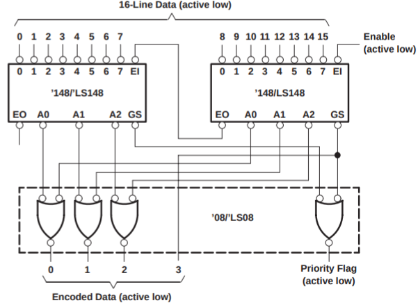
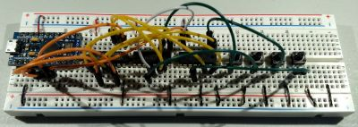

# Binary Encoded 16-to-4 Buttons

The `Encoded16To4Buttons.ino` is a sample code for `EncodedButtonConfig`
(which is a generalization of `Encoded4To2ButtonConfig` and
`Encoded8To3ButtonConfig`) to show how it can be used to handle
15 buttons with 4 pins. These classes are described in detail in
[BinaryEncoding](../../docs/binary_encoding/README.md).

This program demonstrates 16-to-4 encoding to support 15 buttons using 4 pins
using:

* 2 x [74LS148](https://www.ti.com/product/SN74LS148) 8-line to 3-line
  priority encoder
* 1 x [74LS08](https://www.ti.com/lit/ds/symlink/sn54ls08.pdf) quad 2-input AND
  gate
* 1 x SparkFun Pro Micro (clone)
* 4 x push buttons

A partial schematic is:



Here is the breadboard that implements this circuit, but with only pins 1, 7, 8,
and 15 for demonstration purposes:



## Sample Output

The sample output looks where each button was Pressed then Released, then was
Pressed/Released quickly to generate a Clicked event. Blank lines were added for
readability:

```
handleEvent(): virtualPin: 1; eventType: 0; buttonState: 0
handleEvent(): virtualPin: 1; eventType: 1; buttonState: 1

handleEvent(): virtualPin: 7; eventType: 0; buttonState: 0
handleEvent(): virtualPin: 7; eventType: 1; buttonState: 1

handleEvent(): virtualPin: 8; eventType: 0; buttonState: 0
handleEvent(): virtualPin: 8; eventType: 1; buttonState: 1

handleEvent(): virtualPin: 15; eventType: 0; buttonState: 0
handleEvent(): virtualPin: 15; eventType: 1; buttonState: 1

handleEvent(): virtualPin: 1; eventType: 0; buttonState: 0
handleEvent(): virtualPin: 1; eventType: 2; buttonState: 1
handleEvent(): virtualPin: 1; eventType: 1; buttonState: 1

handleEvent(): virtualPin: 7; eventType: 0; buttonState: 0
handleEvent(): virtualPin: 7; eventType: 2; buttonState: 1
handleEvent(): virtualPin: 7; eventType: 1; buttonState: 1

handleEvent(): virtualPin: 8; eventType: 0; buttonState: 0
handleEvent(): virtualPin: 8; eventType: 2; buttonState: 1
handleEvent(): virtualPin: 8; eventType: 1; buttonState: 1

handleEvent(): virtualPin: 15; eventType: 0; buttonState: 0
handleEvent(): virtualPin: 15; eventType: 2; buttonState: 1
handleEvent(): virtualPin: 15; eventType: 1; buttonState: 1
```
