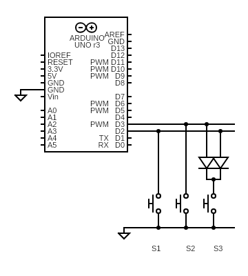

# Encoded 4To2 Buttons

The `Encoded4To2Buttons.ino` program implements the
[BinaryEncoding](../../docs/binary_encoding/README.md) wiring and decodes the
buttons using the `Encoded4To2ButtonConfig`
class. It was tested using 3 buttons on a breadboard using both diode.

## Encoding Using Diodes

Here is the schematic using 2 diodes:

Here is the breadboard that implements this circuit. I don't have a photo of the
circuit using 3 buttons, but it was similar to this photo using 7 buttons:

