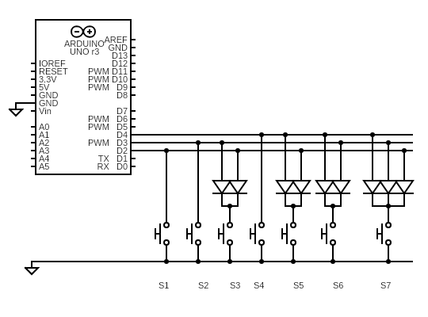
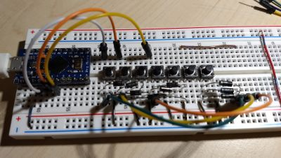
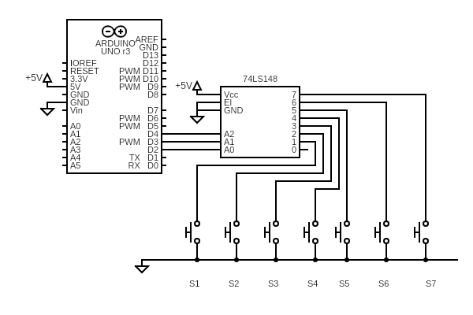
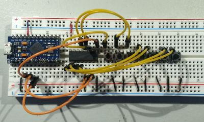

# Encoded 8To3 Buttons

The `Encoded8To3Buttons.ino` program implements the
[BinaryEncoding](../../docs/binary_encoding/README.md) wiring and decodes the
buttons using the `Encoded8To3ButtonConfig` class. It was tested using 7 buttons
on a breadboard using both diodes and the
[74LS148](https://www.ti.com/product/SN74LS148) chip.

## Encoding Using Diodes

The schematic using 9 diodes:

Here is the breadboard that implements this circuit:

## Encoding Using 74LS148

The schematic using the 74LS148 chip:

Here is the breadboard that implements this circuit:

