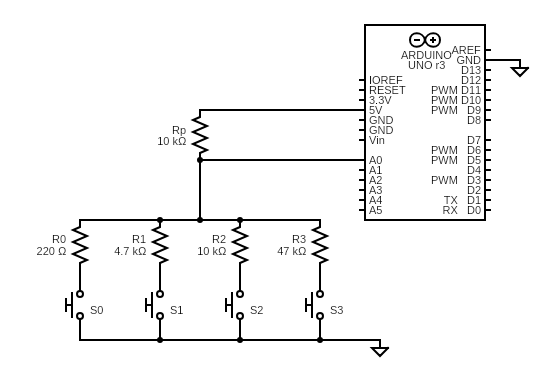
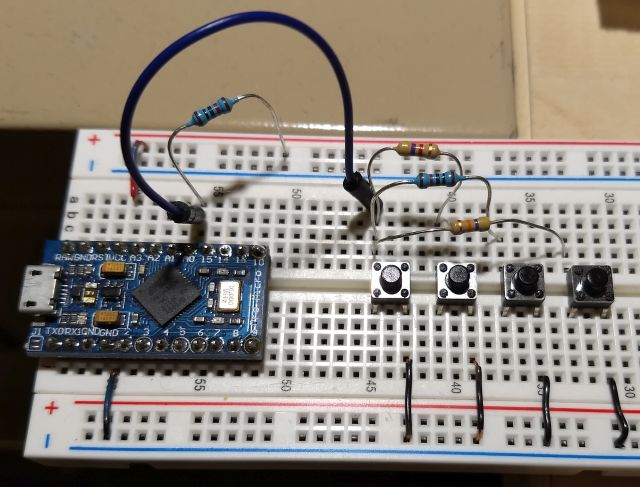

# Resistor Ladder Buttons

The `LadderButtons.ino` is a sample code for `LadderButtonConfig` which
supports multiple buttons on a single analog pin. The buttons are distinguished
by using a resistor ladder that sets the voltage to different values. The
voltage can be read using the `analogRead()` function.

This program demonstrates 4 buttons using 4 resistors:

* 1 x SparkFun Pro Micro (clone)
* 4 x push buttons
* 1 x 4.7 kohm resistor
* 2 x 10 kohm resistor
* 1 x 47k kohm resistor

See [Resistor Ladder](../../docs/resistor_ladder) for documentation on
how to use the `LadderButtonConfig` class.

## Circuit and Breadboard



The circuit above shows a 220 Ohm current-limiting resistor on Button 0. I was
lazy and did not use it for this breadboard:



## Sample Output

### `MODE_READ_BUTTONS`

When `LadderButtons.ino` is compiled with:
```C++
#define MODE MODE_READ_BUTTONS
```
it reads 4 buttons connected to the `A0` analog pin.

The sample output shows where each button was Pressed then Released. Blank lines
were added for readability:

```
handleEvent(): virtualPin: 0; eventType: 0; buttonState: 0
handleEvent(): virtualPin: 0; eventType: 1; buttonState: 1

handleEvent(): virtualPin: 1; eventType: 0; buttonState: 0
handleEvent(): virtualPin: 1; eventType: 1; buttonState: 1

handleEvent(): virtualPin: 2; eventType: 0; buttonState: 0
handleEvent(): virtualPin: 2; eventType: 1; buttonState: 1

handleEvent(): virtualPin: 3; eventType: 0; buttonState: 0
handleEvent(): virtualPin: 3; eventType: 1; buttonState: 1
```

### `MODE_CALIBRATE`

When the program is compiled with

```C++
#define MODE MODE_CALIBRATE
```

the values of `analogRead()` is printed as fast as possible. It will look
something like:

```
1023
1023
1023
1023
...
23
24
23
23
23
...
332
333
332
333
333
...
513
514
514
515
514
514
...
842
843
843
842
843
...
```
